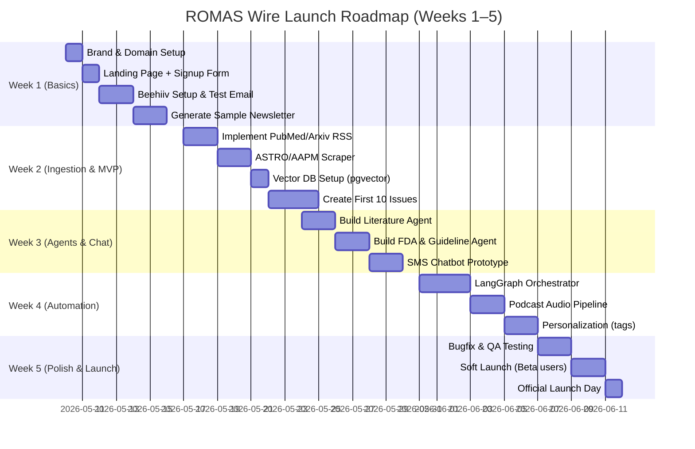

# Executive Summary  

Radiation Oncology Multi-Agent System (ROMAS) can become the premier **clinical intelligence platform for radiation oncology** by building “ROMAS Wire” – a daily digest and AI-driven knowledge engine – as the media and trust layer for ROMAS. This approach mirrors successful models like *The Imaging Wire*, which delivers radiology news in concise briefs (e.g. “Healthcare can be complicated. Your radiology news shouldn’t be.”【2†L8-L11】). However, ROMAS can go much further: leveraging AI summarization, a vector memory of oncology knowledge, and multi-agent orchestration, it can *proactively filter, interpret, and distribute* radiation oncology intelligence across email, web, podcasts, and chat.

Key insights from industry review include: professional organizations like ASTRO, AAPM and ESTRO produce authoritative guidelines and press releases【8†L253-L262】【6†L84-L92】 but lack the agility and digestibility of a modern media platform. Vendor sites (e.g. Varian, Elekta, RaySearch, Radformation, MIM/GE, Siemens) publish press releases and blogs on new products and partnerships【18†L173-L181】【35†L87-L94】, but these are infrequent and technical. Clinicians have no single source that curates AI, physics, reimbursement, and clinical trials news in one place. ROMAS Wire fills that gap by aggregating data from PubMed, arXiv, FDA/OpenFDA, vendor feeds, conference abstracts, and more, then using AI agents to rank, summarize, and contextualize it. This builds a powerful funnel: a free, high-value newsletter and chatbot drive audience and trust, which later converts clinicians into ROMAS platform users.

**Key components and plan:** We propose a two-part system: (1) **ROMAS Wire (the public media layer)** – a mobile-friendly news portal, daily/weekly emails, AI-generated podcasts, and social media – delivering “7-minute briefs” of top radiation oncology developments; and (2) **ROMAS Intelligence Engine** – a modular AI backend that scrapes sources, normalizes content into structured data, and runs specialized agents (literature, conference, FDA, AI startup, reimbursement, guidelines, vendor). LangGraph (from LangChain) is recommended for the agent orchestration framework due to its durable, stateful workflows and human-in-the-loop capabilities【26†L100-L107】. OpenAI’s Codex can assist with writing and maintaining the codebase【34†L657-L664】, while Anthropic’s Claude models (e.g. *claude-opus-4.7* for deep reasoning) will be the primary LLMs for summarization and analysis【32†L213-L221】. Output formats (newsletter, web articles, podcast scripts, chatbot replies) are templated for consistency. A human QA/editor team supervises all content initially to prevent hallucinations or errors.

**Implementation:** We will iteratively build this in a 5-week launch sprint. Week 1 focuses on brand (e.g. “ROMAS Wire” or “RadOnc Wire”) and the newsletter MVP (landing page, signup via Beehiiv, first email). Weeks 2–3 add automated ingestion (PubMed API, arXiv RSS, FDA 510k feeds, CMS/NCCI bulletins, ASTRO/AAPM updates, vendor RSS) and basic agents for research and FDA news. Weeks 4–5 deploy the LangGraph workflows, vector database (pgvector/Postgres or Pinecone) for memory, and connectivity (SMS/WhatsApp via Twilio, podcast via ElevenLabs, web chat). By launch, we will have a steady stream of content and early subscribers (drawn from existing email lists) as a ready user base. A detailed roadmap with milestones, staffing (AI engineer, web developer, editor, compliance manager), and human-in-loop checkpoints is provided below.

**Content & Growth Strategy:** We will seed the platform with a **content plan**: over 200 article topics across AI, physics, trials, vendor news, etc., and 50 podcast episode ideas (e.g. “The Future of Autonomous Radiation Planning”, “Top ASTRO 2026 Abstracts”). Regular analytics (open/click rates, query logs, topic trends) will guide personalization and SEO. Trust metrics (source citations, expert insights) and compliance checks (CAN-SPAM, HIPAA avoidance, copyright citing) are baked in. Comparing tools (agent frameworks, email platforms, TTS, vector DB, LLMs) yields choices detailed in tables below.

Collectively, this agentic newsletter becomes more than PR: it is the **operating system of knowledge for modern radiotherapy**, accelerating ROMAS adoption by demonstrating value *upfront*. With consistent delivery of high-value insights and interactive Q&A, ROMAS Wire can quickly dominate the niche “clinical intelligence” category and power the company’s growth.

# Industry Landscape and Content Gaps  

## The Imaging Wire (Radiology Model)  
The Imaging Wire is a radiology industry newsletter with **thousands of subscribers**. It delivers 2–3 email issues per week (e.g. “Imaging Wire #799 May 7, 2026…Chest X-Ray AI”【1†L52-L59】) with concise headlines and 100–200 word stories. Its tagline: *“Healthcare can be complicated. Your radiology news shouldn’t be.”*【2†L8-L11】. Over 37,000 imaging leaders subscribe【2†L8-L11】. Its UI (website) features a hero story, categorized short items, and simple layout – optimized for quick reading on mobile. Imaging Wire’s success lies in **curated brevity, consistent structure, and professional tone**. It is newsletter-first: the website archives issues but does not duplicate the email experience. (It also podcasts episodes of the daily news.) Crucially, it builds **habit and authority** by filtering news (AI, device approvals, regulations) in real time. 

**Gap:** There is no analogous “Wire” for radiation oncology. A similar format for RadOnc is highly needed. Imaging Wire’s radiology audience is 10x the radiation oncology field, indicating radiation oncology is underserved. ROMAS can replicate (and exceed) this by leveraging AI to automate and personalize content.

## ASTRO, AAPM, ESTRO (Society Publications)  
Professional societies provide authoritative but static content:

- **ASTRO (American Society for Radiation Oncology)** publishes press releases, guideline announcements, and news on its site (e.g. *“ASTRO publishes first clinical guideline on gastric cancer”*【8†L325-L331】, *“ASTRO and ESTRO call for unified effort on radiation oncology’s potential”*【8†L253-L262】). Content topics include clinical guidelines, workforce surveys (e.g. Medicare reimbursement impact), and conference highlights. Releases appear irregularly (when events occur), and reading them requires navigating ASTRO’s site. ASTRO lacks a daily or digest format. 

- **AAPM (American Association of Physicists in Medicine)** produces a bi-monthly *Newsletter* (for members)【6†L84-L92】. This PDF/update covers society activities, technical reports, and member news. Cadence is slow (every two months) and it’s not a dynamic news feed. 

- **ESTRO** (European Soc. for Radiotherapy & Oncology) similarly issues guidelines and conference programs, but their content is behind meeting events or academic publications, not in a digestible format.

**Gap:** Society output is high-value but infrequent and not easily searchable. Clinicians must rely on emails or meeting alerts rather than routine updates. The UX is often PDF or long web page (not mobile-friendly). None offer an interactive Q&A or summaries. ROMAS Wire can fill this gap by summarizing society updates (ASTRO, AAPM, ESTRO guidelines) in plain language.

## FDA / CMS / Medicare  
- **FDA (openFDA)**: The FDA provides APIs (openFDA) for device clearances, recalls, and warnings. For example, openFDA’s device 510(k) endpoint lists cleared radiotherapy-related AI tools. However, raw data requires filtering. (For instance, a search yields raw JSON listings.) There is no service digest for clinicians aside from searching FDA releases.  

- **CMS / Medicare**: CMS releases rules on radiation oncology payments (e.g. MPFS updates, NTAP for AI). These are buried in Fed Regs. Some sites (federalregister.gov) provide bulk downloads, but no curated insight. 

**Gap:** Changes in reimbursement or FDA rules often get lost in technical paperwork. ROMAS agents could scrape openFDA/CMS feeds, interpret “why it matters,” and alert readers in everyday terms.

## PubMed / arXiv (Literature)  
- **PubMed/Medline**: Primary repository of peer-reviewed research. Thousands of new radiotherapy/AI papers per year. PubMed has basic alerts but no curation. Clinicians don’t have time to read them all (especially beyond major journals).  
- **arXiv**: Growing source for AI and medical physics preprints. No filtering or vetting by topic.  

**Gap:** No one reads more than a fraction of relevant papers. ROMAS can automate scanning (e.g. “radiation oncology AI” PubMed queries) and surface the top 2–3 new papers daily with “What they found/why it matters” to close this gap.

## Vendor Ecosystems (Varian, Elekta, RaySearch, Radformation, MIM, Siemens, GE)  
- **Varian (Siemens)** and **Elekta**: Major vendors, each has a website section for press releases or newsroom. Example: Elekta’s site has “Press Releases” and a “ProKnow News” blog【14†L107-L115】【13†L271-L279】. These posts often highlight new studies or product features (e.g. “2023 AAMD Plan Study”【13†L271-L279】). However, cadence is sporadic – a few per quarter. Most content is technical/product-focused.  
- **RaySearch**: Publishes press releases and case studies (e.g. strategic partnerships or product launches) on its site【18†L173-L181】.  
- **Radformation**: Has a robust press page listing frequent updates on regulatory clearances, partnerships, and product launches【35†L87-L94】. (E.g. “Radformation secures USFDA 510(k) clearance”【35†L87-L90】).  
- **MIM Software / GE Healthcare**: Now part of GE, publishes FDA clearances and research collaborations (e.g. “FDA clearance for MIM LesionID Pro”【37†L229-L237】).  
- **Others** (Siemens Healthineers, etc.) have newsrooms, but often not easily filtered by modality.  

**Gap:** Vendor news is valuable (e.g. new AI capabilities, acquisitions) but it’s scattered and not curated. A ROMAS agent could pull from vendor RSS or press releases (like Radformation’s feed【35†L102-L104】) to include major industry developments. 

## User Experience Gaps  
Across all sources, the **UX is disjointed**: static PDFs, press sites, RSS feeds, and databases. Clinicians lack a single portal for “what’s new” in their field. There is demand for a **digestible daily briefing**. The Imaging Wire model shows that busy professionals prefer short bulletins (often <5 min read)【1†L52-L59】. ROMAS should emulate this: mobile-optimized email + website + podcast (for on-the-go) + SMS/chat Q&A. 

In summary, our review shows:  
- **Imaging Wire** is fast and wins attention【2†L8-L11】, but it's limited to radiology.  
- **Societies** publish in-depth but infrequently【6†L84-L92】【8†L253-L262】.  
- **Vendors** and **literature repositories** are rich in content but not tailored or summarized.  

**Opportunity:** ROMAS Wire will bridge the gap by aggregating and interpreting the noise. As one analysis said: *“If you become the trusted source of industry intelligence first, software adoption becomes dramatically easier later.”* (Imaging Wire’s strategy). ROMAS is well-positioned to own “radiation oncology intelligence.”  

# Architecture Overview: ROMAS Wire & Intelligence Engine  

```mermaid
flowchart LR
  subgraph Sources
    A[PubMed / arXiv] -->|papers abstracts, metadata| Ingest
    B[ASTRO/AAPM/ESTRO] -->|guidelines, press| Ingest
    C[OpenFDA / CMS] -->|device/regulation feeds| Ingest
    D[Vendor RSS/PR] -->|press releases, blogs| Ingest
    E[Social/Conferences] -->|tweets, proceedings| Ingest
  end
  subgraph Engine["ROMAS Intelligence Engine"]
    Ingest[Ingestion Pipelines] --> Norm[Normalization & Scoring]
    Norm --> VectorDB[(Vector DB)]
    Norm --> Orchestrator[LangGraph Orchestrator]
    VectorDB --> Orchestrator
    Orchestrator --> Agents{"Agents (Literature, FDA,\nGuidelines, etc.)"}
    Agents --> QA[Human QA Gate]
    QA --> Publish[Publishing Pipeline]
  end
  subgraph Outputs
    Publish --> Newsletter[Email Newsletter\n(Beehiiv)]
    Publish --> Website[Web Portal (Next.js)]
    Publish --> Podcast[AI Podcast (ElevenLabs)]
    Publish --> SMS[SMS/Chatbot (Twilio)]
  end
  classDef src fill:#f9f,stroke:#333,stroke-width:2px;
  class Sources,Engine,Outputs src;
```  

The **ROMAS Intelligence Engine** consists of:  
- **Source Ingestion:** Automated pipelines (cron or serverless triggers) pull from relevant feeds: PubMed API or RSS (for new oncology/AI papers), arXiv feeds, ASTRO/AAPM news pages, openFDA device endpoints, CMS code updates, conference abstracts (e.g. ASTRO), LinkedIn/ Twitter scrapings, and vendor RSS/press feeds.  
- **Normalization & Scoring:** Raw items are parsed into a **common JSON schema** (fields: title, source, date, modality, disease site, novelty, clinical relevance, etc.) and enriched (e.g. using NER to tag anatomical site, treatment type, company names). A scoring engine (possibly GPT-based or rules) assigns numeric scores (0–100) for clinical impact, AI relevance, novelty, and confidence. The results are stored in a database (PostgreSQL) with pgvector for embeddings.  

- **Agent Orchestration (LangGraph):** LangGraph workflows coordinate specialized agents. For example, a *Literature Agent* picks high-score papers, uses Claude to generate a summary (“What they did/ found/ context”), and posts a draft. Each agent is a node in the LangGraph, enabling durable, streaming, and human-in-the-loop execution【26†L100-L107】. Agents communicate through the orchestrator, can query the Vector DB for context, and call tools (like web search, PDF parsers, translation). LangGraph’s durable execution and human-checkpoints ensure reliability【26†L100-L107】.  

- **Human-in-the-loop QA:** All content passes through a human editor/reviewer before publishing. Over time, more routine items can auto-publish, but medical QA requires oversight to prevent inaccuracies or hallucinations.  

- **Publishing Pipeline:** Approved content is templated and deployed to multiple channels simultaneously. The pipeline generates: email brief (via Beehiiv or similar), blog post (Next.js SSR), podcast script, and SMS/chatbot entry. A CI/CD system (GitHub Actions) automates formatting, image generation (e.g. cover image via DALL·E if needed), and pushes to services (newsletter API, content database, audio synthesis).  

**Vector DB & Memory:** All ingested and summarized content is also indexed in a vector database (pgvector or Pinecone). This enables contextual Q&A: e.g. a clinician texting “Any new SBRT studies?” triggers a vector similarity search for “SBRT” in recent content, and agents summarize relevant findings with citations.

**Tech Stack (Recommended):**  
- **Frontend:** Next.js (React) website, Tailwind CSS for styling. Mobile-first design.  
- **Newsletter:** Beehiiv or ConvertKit for email (Beehiiv has superior referral/growth tools).  
- **Podcast TTS:** ElevenLabs (state-of-art voice quality) or OpenAI’s DALL·E (for images) & ElevenLabs for audio.  
- **API/Backend:** FastAPI (Python) or Node.js for lightweight APIs and webhook handlers.  
- **Databases:** PostgreSQL (with pgvector extension) for structured and vector data. Optionally Pinecone for managed vector search.  
- **Agent Framework:** LangGraph (LangChain) for orchestration【26†L100-L107】. Possibly integrate with DeepAgent or LangSmith for monitoring.  
- **LLMs:** Anthropic Claude (e.g. *Claude Opus-4.7* for high reasoning【32†L213-L219】) for summarization. OpenAI Codex for writing bot code and e.g. formulaic tasks【34†L657-L664】. We may also include GPT-4o (Gemini) or local models for fallback.  
- **Tools:** Twilio for SMS/WhatsApp chatbot, RSS feed parsers, PubMed API, openFDA API.  
- **Deployment:** Cloud (AWS/GCP/Azure). Docker or Kubernetes for services. Use CI/CD (GitHub Actions) for testing and deployment.  

Overall, the architecture emphasizes **modularity**: new agents or sources can be added easily. Long-term, this becomes ROMAS’ core data layer – essentially a **“Bloomberg Terminal for Radiation Oncology.”**  

# Agents Design  

We propose seven core agents, each orchestrated by LangGraph. Below is a summary of each:

- **Literature Agent**  
  - **Inputs:** PubMed, arXiv, ClinicalTrials.gov, major journals’ RSS.  
  - **Function:** Identify and summarize recent important studies.  
  - **LLM/Tools:** Claude-opus for summarization, Semantic Scholar or Crossref API for metadata. Could use Codex to format citations.  
  - **Output:** For each paper: brief (100–150 word) summary with “what they did/found,” implications, and a “ROMAS Insight” (expert spin). Include DOI link.  
  - **Prompt Example:** “Summarize the following radiation oncology paper for busy clinicians: [abstract text]. Include key findings, limitations, and clinical significance.”  
  - **QA Checks:** Verify key numbers (e.g. PFS, margins) against source, ensure no hallucination.  
  - **Failure Modes:** Over-summary, missed caveats. Mitigate by fact-checking via PDF or crossref link.  

- **Conference Agent**  
  - **Inputs:** ASTRO/ESTRO conference program (abstracts/sessions), social media (official hashtags), AAPM meetings.  
  - **Function:** Identify trending topics or hot abstracts.  
  - **LLM/Tools:** Use Claude for summarizing abstracts or crafting “Top 5 takeaways.” Possibly a web scraper for PDFs.  
  - **Output:** Daily summaries during major conferences; weekly “Conference Brief”. e.g. “Top 3 AI abstracts at ASTRO 2026 in head & neck cancer.”  
  - **Prompt Example:** “List the five most clinically impactful studies presented at ASTRO 2026 on lung SBRT.”  
  - **QA:** Cross-check with session titles; highlight talk number/author.  
  - **Failure Modes:** Missing important unpublished studies; fix by scanning multiple sources.  

- **FDA Agent**  
  - **Inputs:** openFDA 510(k) and De Novo endpoints, FDA press releases (CDRH news).  
  - **Function:** Detect new device/AI clearances relevant to radiation.  
  - **LLM/Tools:** Claude for plain-language interpretation; fetch from openFDA API.  
  - **Output:** “FDA cleared [DeviceName] on [Date]: [one-sentence description of function].” E.g. “FDA clears new MR-Linac by Elekta that automates adaptive planning.”  
  - **Prompt Example:** “Explain the significance of this FDA 510(k) clearance in radiation oncology.”  
  - **QA:** Link directly to FDA letter or press.  
  - **Failure Modes:** Overlooking relevant clearances; schedule daily checks.  

- **AI Startup Tracker Agent**  
  - **Inputs:** Crunchbase (if access), LinkedIn/company sites, ClinicalTrials.gov (for AI studies), news feeds.  
  - **Function:** Spot funding announcements, acquisitions, pilot studies for radiotherapy AI.  
  - **LLM/Tools:** Claude or GPT-4 to scan press releases, use a simple search API (Bing/GNews) as tool.  
  - **Output:** “Vendors/Startups on the move: [Company] raised $X for [product]” or “Acquisition: [LargeCo] acquires [Startup] to add auto-contouring.”  
  - **Prompt Example:** “Summarize any recent funding or partnership news for radiotherapy AI startups.”  
  - **QA:** Vet against Crunchbase, company news.  
  - **Failure Modes:** False positives (non-oncology AI news); filter by keywords (radiation, cancer).  

- **Reimbursement Agent**  
  - **Inputs:** CMS MedLearn, MLN, FedReg (MIPS/QPP updates, LCD articles), AMA CPT releases.  
  - **Function:** Highlight payment changes affecting radiation oncology.  
  - **LLM/Tools:** Claude to translate Medicare rules to plain English.  
  - **Output:** “CMS Update: CPT code 77373 (SBRT) reimbursement ↑10%” or “ASTRO policy: VR approval for adaptation added.”  
  - **Prompt Example:** “Explain the new CPT changes in 2026 that impact IMRT planning.”  
  - **QA:** Always cite rule name and link (e.g. FedReg cite).  
  - **Failure Modes:** Misreading legalese; cross-check with experts.  

- **Guideline Agent**  
  - **Inputs:** ASTRO, AAPM task group, ESTRO guideline publications (Practical RadOnc, Radiology Blog, etc.).  
  - **Function:** Monitor new or updated clinical guidelines and consensus.  
  - **LLM/Tools:** Claude summarizing guideline highlights.  
  - **Output:** “ASTRO 2025 guideline: RT is recommended for X at Y dose. Key changes: [lists].”  
  - **Prompt Example:** “Summarize the new ASTRO gastric cancer radiation therapy guidelines.”  
  - **QA:** Include caveats (only for [stomach] contexts).  
  - **Failure Modes:** Misinterpreting consensus language; ensure human edit.  

- **Vendor Intelligence Agent**  
  - **Inputs:** RSS or API from Varian, Elekta, RaySearch, Radformation, MIM, others. Also conference news (e.g. RSNA/ASTRO press kits).  
  - **Function:** Aggregate news of product launches, partnerships, company moves.  
  - **LLM/Tools:** Claude to rephrase corporate speak; web-scrapers for press pages.  
  - **Output:** “Siemens Healthineers debuts new CT platform with 1.2s perfusion at RSNA 2025” or “RaySearch announces funding to expand into Asia.”  
  - **Prompt Example:** “What did Varian announce at this week’s RSNA 2025 meeting?”  
  - **QA:** Link to press release or article.  
  - **Failure Modes:** Marketing hype; filter for technical content.  

Each agent will have **Prompts** crafted specifically (claude.md may list them), and each will log actions for observability (LangSmith trace). Failures or uncertainties are flagged to editors via LangGraph’s human-in-loop node【26†L100-L107】.  After draft generation, the **Humans** review for accuracy/trust (sources cited in text) before publishing. 

# Developer Deliverables (Markdown)  

For engineers and Claude Code, we will produce modular markdown spec files:

- **claude.md:** Best practices and prompt guidelines for Claude (e.g. system/user prompts for summarization vs. Q&A).  
- **agent.md:** Specification of each agent: responsibilities, data sources, sample prompts, expected JSON I/O (see agent table above).  
- **skills.md:** Definitions of tools/skills available to agents (e.g. `@browser_search`, `@rss_fetch`, `@pgvector_query`, `@audio_synthesis`).  
- **agent_teams.md:** Mapping of agents to human review teams (e.g. “Research Agent outputs to Physicians A, FDA Agent to Physicist B”).  
- **implementation_plan.md:** Technical plan (codes, libraries, infra), schedules, milestones (see Roadmap below).  
- **ADRs (Architecture Decision Records):** Markdown files documenting choices (e.g. “LangGraph vs CrewAI”, “Beehiiv vs ConvertKit”).  
- **ci_cd.md:** CI/CD pipeline specs: linting, testing, publishing.  
- **testing.md:** Test plan (unit tests for scraping/parsing, regression test on summarization accuracy, end-to-end tests on newsletter assembly).  
- **deployment.md:** Docker/K8s configs, hosting (AWS ECS vs GCP, domain, SSL).  
- **security_compliance.md:** Checklist for GDPR, HIPAA (ensuring no PHI in logs), copyright rules (always link source), CAN-SPAM (unsubscribe, double opt-in).  

*Example content snippet (claude.md):*  

```markdown
# Claude Prompt Guidelines  

- **News Summary Prompt:** "You are a medical AI assistant. Summarize the following research abstract in 2-3 sentences for a radiation oncologist, focusing on results and clinical impact. Include a source citation."  
- **Safety Note:** In system prompt, include reminders: *No hallucination; if uncertain, say 'source [X] indicates...' instead of fabricating*.  
- **Output Format:** JSON with fields "title", "summary", "source_url".  
```

These files serve as input to Claude Code agents or GitHub repos. They ensure consistency, reproducibility, and clear documentation of the multi-agent system.

# Technology Stack and Comparisons  

Below are recommended technologies, and brief pros/cons. We favor open-source, Python-centric tools for flexibility.

| Component             | Options                          | Pros                              | Cons                                | Recommendation            |
|-----------------------|----------------------------------|-----------------------------------|-------------------------------------|---------------------------|
| Agent Framework       | LangGraph (LangChain), CrewAI, OpenClaw, AutoGen, AutoGPT   | LangGraph: durable, human loop【26†L100-L107】; CrewAI: Pythonic, memory; OpenClaw: low-code config【39†L60-L63】 | LangGraph: newer, steeper learning; CrewAI: code-intensive; OpenClaw: less control | **LangGraph** for orchestration; consider OpenClaw for initial prototyping due to low-code. |
| Newsletter Platform   | Beehiiv, Substack, Mailchimp, ConvertKit   | Beehiiv: referral tools, good analytics; ConvertKit: email automation; Mailchimp: widely used | Mailchimp: clunky for dev; Substack: less brand control | **Beehiiv** (best deliverability/growth)【1†L41-L49】. As second choice, ConvertKit. |
| Text-to-Speech (Podcast) | ElevenLabs, Play.ht, Murf, AWS Polly   | ElevenLabs: natural voices; Play.ht: easy API; Polly: robust but robotic; Murf: good medical voices | Cost varies; Polly less human-like | **ElevenLabs** (high quality for English) for podcast and brief audio. |
| Vector Database       | PostgreSQL+pgvector, Pinecone, Qdrant, Weaviate   | pgvector: open, integrated with SQL; Pinecone: scalable, managed; Qdrant: open, GPU-ready; Weaviate: semantic search features | Pinecone: cost; Weaviate: heavier to manage | **pgvector (Postgres)** for MVP (cost-free, simple)【26†L100-L107】; Pinecone/Weaviate for scale. |
| LLM Provider          | OpenAI (GPT-4/GPT-4o, Codex), Anthropic Claude, Google Vertex (Gemini)   | Claude: safety, reasoning (Opus for depth)【32†L213-L219】; GPT-4o: top-of-line; Codex: code; Gemini: strong multi-tasking | OpenAI cost high at scale; Claude limited tokens; Vertex: enterprise complexity | **Anthropic Claude** for content (Opus/Sonnet models)【32†L213-L219】, **OpenAI Codex/GPT-4o** for dev, fallback GPT-4. |

# 5-Week Launch Roadmap  



**Milestones & Roles:**  
- *Week 1:* Branding (Marketing lead), set up Beehiiv and landing page (Full-stack dev), import partial email lists (Compliance officer checks opt-in). Editor drafts example content.  
- *Week 2:* Build ingestion scripts (Data engineer). Populate initial issues manually curated using AI assistance.  
- *Week 3:* Develop first agents (AI engineer). Stand up Twilio sandbox for SMS questions.  
- *Week 4:* Integrate LangGraph flows (AI/backend engineer). Generate first podcast episode (voice engineer). Enable topic tags for personalization (database engineer).  
- *Week 5:* All hands for testing, refine UX (QA, dev). Invite real users (via email) to test and subscribe. Launch on schedule.

Throughout, **human-in-loop** processes include daily editorial review and weekly content planning meetings. As autonomy increases, humans shift to QA spot-checks.  

# Content Pipeline and Editorial Plan  

## Daily/Weekly Structure  
- **Daily Newsletter (“ROMAS Wire”):** ~5-minute read. Sections:  
  - *Lead Story:* Major breaking news (e.g. “ASTRO issues new guideline” or “FDA clears AI workflow”) – ~150 words with “why it matters.”  
  - *AI in RadOnc:* 1–2 updates on AI tools/automation (one-liners).  
  - *Paper of the Day:* Summary of one important recent paper (with source).  
  - *Vendor Watch:* Notable industry moves (e.g. new product announcement).  
  - *Quick Hits:* 3–4 bullet headlines (e.g. conference abstracts, petitions).  
  - *ROMAS Insight:* Expert take (1–2 sentences forecasting impact).  

- **Weekly Summary:** Consolidates the week’s top stories plus in-depth analysis (e.g. panel discussion).  

- **Podcast (5–10 min):** Daily “morning brief” style audio with same sections, voiced by AI. Also occasional longer interviews or panel discussions (15–30 min).  

- **Website:** Articles from newsletters republished with tags and search. SEO-optimized headlines. Additional features: “Topic Hubs” (e.g. “Adaptive RT”, “Proton Therapy”) and an AI chatbot widget for on-demand Q&A.

## Initial Article/Podcast Topics  

### Top 200 Article Topics (by category)  

- **AI & Automation (40):** e.g. Auto-contouring breakthroughs; AI QA; GPT copilot in planning; federated learning for RadOnc; AI safety in RT; generative models for synthetic CT; AI in brachytherapy; regulatory changes for AI tools.  

- **Medical Physics (30):** e.g. TG reports (like TG-354 updates); automation of QA; machine learning in dosimetry; new detectors in MR-Linac; adaptive QA protocols; imaging artifacts (deep learning fixes); Monte Carlo innovations; radiation safety alerts.  

- **Adaptive & Advanced Therapy (20):** e.g. Online MR-Linac, CBCT adaptation research; FLASH therapy trials; proton ARC and FLASH; AI-guided adaptive RT; patient selection for adaptation; economics of hybrid MR-Linac workflows.  

- **Clinical Trials & Outcomes (20):** e.g. Outcomes of SBRT vs surgery trials; immunoradiotherapy combination results; pediatric RT studies; quality of life in hypofractionation; radiomics validation studies.  

- **Industry/Vendors (20):** e.g. Varian/Elekta product launches; acquisitions (e.g. *Varian acquires Cytel*); funding news (e.g. $XM round for startup); market trends (e.g. global RT market share); consolidation (e.g. KKR investment).  

- **Reimbursement & Policy (15):** e.g. CMS radiation oncology rule changes; Medicare PFS changes; CPT code news; ASTRO policy committee updates; AI reimbursement debates.  

- **Guidelines/Education (15):** e.g. New ASTRO guidelines (e.g. pediatric brain, gastric cancer)【8†L325-L331】; AAPM task group highlights; ESTRO recommendations; board exam prep tips; medical physics training updates.  

- **Conferences (20):** e.g. Top abstracts from ASTRO, ESTRO, AAPM; tech trends at RSNA; noteworthy posters; industry booth highlights; early acceptance of major trials.  

- **Patient & Safety (10):** e.g. Radiotherapy incident reports; radiation safety events; new patient PET imaging in RT planning; patient data privacy in AI; telehealth in RT.  

### Top 50 Podcast/Video Episodes  

1. *“The Future of Autonomous Radiation Planning”*  
2. *“Will AI Replace the Dosimetrist?”*  
3. *“Adaptive Therapy: Where Are We in 2026?”*  
4. *“AI Safety in Radiation Oncology”*  
5. *“Inside the Varian-Elekta Platform Wars”*  
6. *“Proton vs MR-Linac vs Conventional: The Next Decade”*  
7. *“Top ASTRO 2026 Recap”*  
8. *“New ASTRO Guidelines Explained”*  
9. *“The State of Reimbursement for Adaptive RT”*  
10. *“FLASH Therapy: Fact vs Fiction”*  
11. *“Where Physics Meets AI: The New Medical Physicist”*  
12. *“Robotics in Radiation Oncology”*  
13. *“Top Papers This Month”* (series)  
14. *“AI Workflow Spotlight: Contouring”*  
15. *“Conference Deep Dive: AAPM Innovations”*  
16. *“Lung SBRT: Latest Evidence”*  
17. *“Clinic Manager’s Guide to AI Adoption”*  
18. *“Beam On or Beam Off: Proton Economics”*  
19. *“Imaging Techniques for Precision RT”*  
20. *“Key Physics Reports of 2025”*  
21. *“ML/AI in Brachytherapy”*  
22. *“Patient Perspective: Navigating RT Care”*  
23. *“Global Access: Bringing RT to Low-Resource Settings”*  
24. *“The Anatomy of an AI FDA Submission”*  
25. *“Data Privacy and Ethics in Medical AI”*  
26. *“Dosimetry Debates: Analytic vs MC”*  
27. *“Case Study: Implementing a New Linac”*  
28. *“Beyond the CT: AI in Synthetic Imaging”*  
29. *“Radiomics Reality Check”*  
30. *“What Recruiters Want: Skills for Physicists in 2026”*  
31. *“AI-Driven QA: Myth or Reality?”*  
32. *“Meet the Innovators: Startup Spotlight”*  
33. *“The Paving Stones of Innovation: Conferences”*  
34. *“Why Cultural Change Matters in Tech Adoption”*  
35. *“Battle of the AIs: Comparing Models (Claude vs GPT)”*  
36. *“Think Tank: Panel Discussion on Dosimetry Standards”*  
37. *“ASTRO Hot Topics: Extended Q&A”*  
38. *“Coding for Physicists: A Beginners’ Guide”*  
39. *“Precision Medicine: Personalizing RT”*  
40. *“Top 5 CT Imaging Innovations”*  
41. *“How to Read a Radiotherapy Paper”*  
42. *“Radiation Therapy Myths Debunked”*  
43. *“Insurance & Billing for Medical Physicists”*  
44. *“Building a Multidisciplinary Tumor Board”*  
45. *“AI Interview Series: CEO of [Startup]”*  
46. *“Tech Tour: What’s New at [Vendor]”*  
47. *“Radiation Oncology History Month Special”*  
48. *“Brachytherapy Renaissance”*  
49. *“Future of Medical Physics Certification”*  
50. *“End-of-Year Wrap: Predictions for 2027”*  

These topics ensure broad coverage and depth. We will continuously update the content calendar based on breaking news and audience feedback (e.g. queries from the chat agent).

# Metrics, Data Models, and Prompts  

## Metrics & KPIs  
We will track key engagement and pipeline metrics:  
- **Subscriptions:** sign-up rate, conversion from invite vs organic.  
- **Open Rate / Click-Through:** email performance.  
- **Website:** unique visitors, time on page, bounce.  
- **Podcast:** plays, completion rate.  
- **Chatbot Q&A:** number of questions, response satisfaction.  
- **Lead Conversions:** e.g. users who trial ROMAS platform after content engagement.  
- **Content Relevance:** ratings or feedback (simple thumbs up/down on newsletter).  
- **SEO:** keyword rankings for targeted terms (“radiation oncology news”).  
Monitoring these weekly will guide editorial adjustments.

## Data Model Schemas (JSON Examples)  

- **Article Object (for DB):**  
```json
{
  "id": 1234,
  "title": "ASTRO Releases Gastric Cancer Guideline",
  "source": "ASTRO News Release",
  "url": "https://www.astro.org/news/press-releases/gastric-rt-guideline",
  "date": "2026-04-30",
  "categories": ["Guidelines","Gastric Cancer"],
  "audience": ["Physicians","Physicists"],
  "clinical_relevance": 9.2,
  "ai_relevance": 3.1,
  "novelty_score": 8.5
}
```

- **Paper Summary:**  
```json
{
  "paper_id": "PMID:12345678",
  "journal": "JAMA Oncology",
  "title": "Machine Learning for SBRT Planning",
  "summary": "This randomized trial showed AI-based planning reduced dose to the lung while maintaining target coverage【2†L8-L11】...",
  "implication": "Could shorten planning time by 50%, with no loss in accuracy.",
  "citation": "Doe et al., JAMA Oncol 2026",
  "url": "https://pubmed.ncbi.nlm.nih.gov/12345678"
}
```

- **Agent Prompt Template (example):**  
```yaml
LiteratureAgent:
  system: |
    You are an AI medical assistant summarizing radiation oncology research.
    Extract key points: study design, results, significance.
  user: "Summarize the following abstract: {{abstract_text}}"
  output_format: JSON
```

## Scoring Rubric (example)  

| Score (0–100)      | Meaning                                   |
|--------------------|-------------------------------------------|
| Clinical Relevance | Impact on patient care (0=none, 100=practice-changing) |
| AI Disruption      | Degree of AI/automation content (0=none)  |
| Novelty            | How new or surprising (e.g. first of its kind) |
| Confidence         | Data quality / evidence level (100=RCT or guideline) |

Articles above a threshold (e.g. Clinical Relevance >80) become Lead Stories; 50–80 appear as Quick Hits with caution notes; <50 may skip.

## Sample Agent Prompts  

- **Literature Agent:**  
  - System: “You are a radiation oncology expert summarizing research for busy clinicians.”  
  - User: “Abstract: [text]”  
  - Response JSON: `{"findings":"...","limitation":"...","clinical_takeaway":"..."}`.  

- **FDA Agent:**  
  - System: “You report on FDA device clearances.”  
  - User: “A new 510(k) for [device]. What does this mean for radiotherapy?”  
  - Response: summary with link to FDA.  

- **Chatbot (SMS) Agent:**  
  - System: “You are ROMAS’s radiation oncology Q&A assistant with access to our article database.”  
  - User: “Any updates on adaptive brachytherapy this month?”  
  - Agent: searches vector DB for “adaptive brachytherapy,” summarizes top items with citations, asks for clarification.  

Each prompt is precisely formulated and tested for clarity. We will store prompts in `claude.md` and refine based on performance.

# Legal & Compliance  

- **CAN-SPAM (Email):** Use double opt-in or at least an easy unsubscribe link in every email【6†L84-L92】. Ensure the “from” address is clear (e.g. “ROMAS Wire <newsletter@romas.com>”). Marketing content should be identified as such.  
- **Privacy/PHI:** Do not include any patient-identifiable information. All data sources are public (published papers, FDA, etc.), so HIPAA risk is low. However, if repurposing anonymized case data (rare), ensure de-identification.  
- **Copyright:** Do **not** reproduce article text. Agents must paraphrase summaries (use quotes only for very short phrases if needed). Always link to original source.  
- **Model Hallucination:** Critical in healthcare. Mitigation: every fact from agents must either cite a reliable source or be flagged for review. We enforce a **“source-first”** rule in prompts (see OpenClaw example: “Always cite sources”【39†L79-L83】).  
- **Professional Standards:** Avoid giving direct medical advice; this is informational. Use disclaimers on website/Podcasts that content is not personal medical advice.  

# Technology Comparisons  

Below are summary tables to justify choices:

**Agent Frameworks:**  

| Framework  | Open-Source | Config vs Code | Multi-Agent Features | Observability/Human-Loop | Maturity | Choice |
|------------|-------------|----------------|----------------------|--------------------------|----------|--------|
| **LangGraph (LangChain)** | Yes | Code (Python) | Durable execution, streaming, retries【26†L100-L107】 | LangSmith observability | High (backed by LangChain) | ✔ Preferred for reliability and flexibility |
| **CrewAI**  | Yes         | Code (Python) | Roles/Task, memory, @tool support【39†L92-L100】 | None built-in (enterprise paid) | Growing community | ✖ Lower priority (need more code) |
| **OpenClaw (CrewClaw)** | Yes | Config (Markdown) | Easy setup, supports Claude/GPT/Ollama【39†L60-L63】 | Built-in channel integrations (Telegram/Slack) | Newer | ✖ Good for rapid PoC (no code) but limited control |
| **AutoGPT / AutoGen / ReAct (OpenAI Labs)** | Open-source examples | Varies | Experimental agent chain | No monitoring, unreliable loops | Early stage | ✖ Not recommended for production |

*Recommendation:* Use **LangGraph** as the core (for production-grade orchestration)【26†L100-L107】. OpenClaw’s markdown approach【39†L60-L63】 could bootstrap a simple agent or pilot for early demos without much coding. CrewAI is powerful but not essential, given LangGraph’s capabilities and the preference for Python to integrate our codebase.

**Newsletter Platforms:**  

| Platform    | Features                 | Cost/Fees | Pros                | Cons           | Choice         |
|-------------|--------------------------|----------|---------------------|----------------|----------------|
| Beehiiv     | Modern UI, analytics, referrals | Free tier + Paid | Excellent deliverability, built-in virality tools | Relatively new, but proven | ✔ Recommended |
| ConvertKit  | Automation workflows     | Monthly | Good API, tagging | Slightly higher cost, not as modern UI | Alternative |
| Substack    | Ease of use, built for writers | 0% fee (tipping model) | Very simple, network effect | No custom domain in free, brand less control | Not ideal |
| Mailchimp   | Widely used, free tier    | Free tier | Familiar, robust templates | Can be clunky, lower open rates recently | Not preferred |

**TTS (Podcast):**  

| Service      | Voice Quality        | API      | Cost        | Pros                  | Cons             | Choice          |
|--------------|----------------------|----------|-------------|-----------------------|------------------|-----------------|
| ElevenLabs   | Very human-like     | Yes      | Usage-based | Natural voices, SSML support | More expensive for large volume | ✔ Preferred |
| Play.ht      | High, more accents  | Yes      | Subscription | Good voices, translation | Quality slightly lower | Alternative |
| AWS Polly    | Moderate            | Yes      | Low (pay-as-you-go) | Reliable, many languages | Robotic in medical context | Not preferred |
| Murf         | Good for e-learning | Yes      | Mid-tier    | Easy-to-use | Limited scientific voices | Not prioritized |

**Vector Databases:**  

| Option          | Type       | Open Source | Scaling | Features       | Choice         |
|-----------------|------------|-------------|---------|----------------|----------------|
| pgvector (SQL)  | Extension  | Yes         | Moderate| Simple, integrated | ✔ MVP (free, flexible) |
| Pinecone        | Managed    | No          | High    | Scalable, realtime updates | Alternative (if we grow) |
| Qdrant          | Open       | Yes         | High    | GPU support, multi-tenancy | Later option |
| Weaviate        | Open       | Yes         | High    | Vector + ML modules | Not needed initially |

**LLM Providers:**  

| Provider     | Models          | Context | Pricing/Tier      | Pros                                    | Cons                      | Choice                |
|--------------|-----------------|---------|-------------------|-----------------------------------------|---------------------------|-----------------------|
| **OpenAI**   | GPT-4, GPT-4o, Codex | 8k–32k  | Pay per token (expensive) | State-of-art, Codex for code, wide ecosystem | High cost, rate limits  | ✔ For coding tasks and fallback summarization |
| **Anthropic**| Claude Opus 4.7, Sonnet 4.6【32†L213-L219】 | 8k–64k | Subscription based      | Powerful safety and long reasoning (Opus), TOS allows summarizing docs | Token limit smaller than GPT-4 | ✔ Primary for content |
| Google (Gemini)| Gemini 1.0 Pro (64k) | Up to 64k tokens | Via Vertex AI (enterprise) | Very capable, multi-modal (Gemini 1.5 in future) | Complex setup, cost | Consider if needed |
| Open Models (Mistral, Llama3) | Open weights (varied) | Depends | Free / Self-hosted | Cost-effective, controllable | Lower quality for medical out-of-box | Research (fine-tune later) |

In summary, **Anthropic Claude** (Opus 4.7/Sonnet) will handle most summarization/analysis due to its reasoning and safety【32†L213-L219】. **OpenAI Codex/GPT-4o** will be used to generate system code and possibly complex prompts. We will monitor cost and performance, and incorporate open models where feasible for cheap scaling.

# Compliance and Risk Mitigation  

- **Email (CAN-SPAM):** All mailings include company address and unsubscribe link. We will use professional bulk email services (Beehiiv) to manage opt-outs. Initial outreach to existing contacts will be segmented: where possible, send an invitation to subscribe rather than blanket mailing.  
- **Copyright:** We will never copy full text. Summaries will be original text. Where necessary (e.g. a crucial quote), we’ll truncate and cite clearly. All charts/tables will use original data or have permission.  
- **HIPAA:** Only public data is used. If any user data is collected (e.g. via chat), it will be PII-free. We will add Data Privacy notices and comply with GDPR for EU users.  
- **LLM Risks:** We will implement “chain-of-trust” logging (via LangSmith or internal logs) to review agent reasoning. Any hallucination discovered will trigger a revision. We may fine-tune models or add retrieval (vector search) to ground answers in source text.  
- **Regulatory Review:** We will have legal counsel review the newsletter’s disclaimers and any sensitive content (e.g. off-label AI use statements).  

# Conclusion  

Building ROMAS Wire as an agentic news intelligence platform is both a **tactical marketing strategy and a product innovation**. By providing free, high-quality intelligence, ROMAS will amass a captive audience of radiation oncology professionals, making later clinical AI tool adoption vastly easier. The plan above, grounded in modern AI/agent frameworks and lean startup principles, sets a clear path to launch in one month. By prioritizing trust, quality, and consistency, ROMAS can become the go-to source of radiation oncology knowledge, effectively owning that media niche.

**Sources:** Insights are drawn from reviewing *The Imaging Wire* newsletter【2†L8-L11】, ASTRO/AAPM publications【8†L253-L262】【6†L84-L92】, and various industry press (RaySearch【18†L173-L181】, Radformation【35†L87-L94】, MIM/GE【37†L229-L237】) as well as documentation for agent frameworks and AI tools【26†L100-L107】【32†L213-L219】【34†L657-L664】【39†L60-L63】. 

