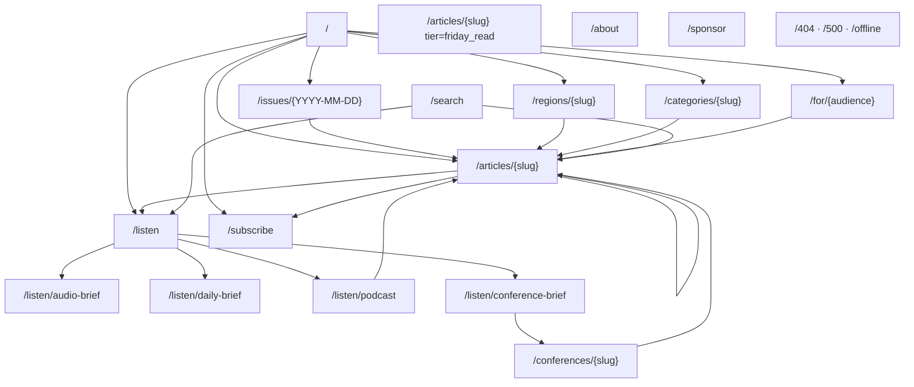
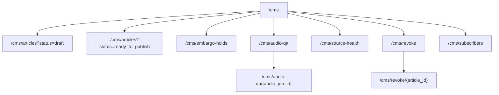

# Information Architecture

## 1. Site map (reader surface — public, anonymous)



## 2. Navigation pattern

### Top nav (persistent on every reader route)

```
┌──────────────────────────────────────────────────────────────────────────┐
│  ROMAS BR[•]EF       Today  ·  Listen  ·  Read  ·  Search   [Region▼]  │
│                                                            [Subscribe → ]│
└──────────────────────────────────────────────────────────────────────────┘
                              ▲ 32px sponsor firewall ▲
```

- **Logo** (variant c — teal dot under "i" in BRIEF) → home.
- **Today** → home (`/`).
- **Listen** → `/listen` (4 tier cards).
- **Read** → opens a dropdown / overlay surfacing Regions · Categories · Audiences · Friday Read · Archive · Conferences. Mobile: full-screen drawer.
- **Search** → `/search`.
- **Region▼** → dropdown for region toggle (8 options: US · Europe · UK · APAC · Canada · LATAM · MENA-Africa · Global). Default = cf-ipcountry auto-detect. Persisted in URL (`?region=eu`) and localStorage.
- **Subscribe** → `/subscribe` (or inline expand on home).

Sponsor firewall: 32px below this nav bar before any sponsor block can render.

### Footer (persistent)

```
ROMAS Wire — Radiation oncology, decoded daily.

Listen  ·  Subscribe  ·  About  ·  Sponsor program  ·  RSS feeds
Audio Brief  ·  Daily Brief  ·  Podcast  ·  Conference Brief
Friday Read  ·  Archive

© 2026 ROMAS Intelligence  ·  All rights reserved  ·  AlienNova
Privacy  ·  Terms  ·  Editorial policy  ·  Contact: brief@romasbrief.com

— Kimal
```

- Sign-off `— Kimal` appears in footer on every page (CLAUDE.md §8).
- No social-media link spam. Email contact only at launch.
- RSS feed URLs surfaced explicitly (audio-first product).

## 3. Routes inventory (12 wireframed routes for /team-build M3)

| # | Route | Purpose | Auth | Cache |
|---|---|---|---|---|
| 1 | `/` | Homepage — 8 modules per FR-028 | Anonymous | Edge-cached, 5min TTL, per-edition variant by region cookie/cf-ipcountry |
| 2 | `/issues/{YYYY-MM-DD}` | Single-issue archive page — date-anchored, full top-5 + Quick Hits | Anonymous | Edge-cached, immutable past issues, 5min current issue |
| 3 | `/articles/{slug}` | Single article — header + AudioPlayer Variant A + body + ROMAS Insight + source attribution + related | Anonymous | Edge-cached, immutable; revoke = 410 |
| 4 | `/articles/{slug}` (tier=friday_read variant) | ROMAS Read with sub-rubric — long-form layout | Anonymous | Edge-cached, immutable |
| 5 | `/listen` | Listen index — 4 tier cards with subscribe links + latest-episode previews | Anonymous | Edge-cached, 5min TTL |
| 6 | `/listen/audio-brief` (and 3 sibling tier pages) | Tier-specific episode list with AudioPlayer Variant B (sticky banner) at top | Anonymous | Edge-cached, 5min TTL |
| 7 | `/conferences/{slug}` | Conference landing during active conference window (ASTRO/ESTRO/AAPM/JASTRO/RANZCR) — banner + day-by-day Conference Brief list | Anonymous | Edge-cached, 1min TTL during active conference, 1h after |
| 8 | `/search` | Search results — Postgres FTS + pgvector | Anonymous | Not cached (per-query) |
| 9 | `/subscribe` | Standalone subscribe surface — region detect + email form + Beehiiv integration | Anonymous | Edge-cached, 1d TTL |
| 10 | `/about` | About — voice + masthead + editorial standards + privacy + contact | Anonymous | Edge-cached, 1d TTL |
| 11 | `/sponsor` | Sponsor program — rate card + firewall rules + booking form | Anonymous | Edge-cached, 1d TTL |
| 12 | `/404` · `/500` · `/offline` | Error / 404 / offline states | Anonymous | Static; offline served from service worker for PWA-ish behavior |

Additional inventory not wireframed (but routed in `apps/reader/`):
- `/regions/{slug}` — 8 region pages (FR-025); same template as `/categories/{slug}` so a single wireframe covers both
- `/categories/{slug}` — 11 category pages (FR-026); shared template
- `/for/{audience}` — 5 audience pages (FR-027); shared template
- `/audio-qa-admin` — internal audio QA console (CMS surface, behind auth — covered in 13th wireframe per LAUNCH_ARC_PLAN.md row "Audio QA admin")

## 4. CMS surface (admin — behind Supabase auth)



CMS routes are NOT in the public reader sitemap. Behind `/cms/*` auth gate (Supabase Auth + RLS). Only the **Audio QA admin** route is wireframed here (per LAUNCH_ARC_PLAN.md trigger 2 row); other CMS routes are admin-ergonomic and `/team-build` M3 authors them against the schema directly.

## 5. URL discipline

- All article URLs use **slug**, not numeric IDs (`/articles/astro-fastrt-trial-2026-05-07`).
- All issue URLs use **ISO date** (`/issues/2026-07-08`).
- Region toggle is a **URL parameter** (`?region=eu`) on home + region/category/audience pages — bookmarkable, share-able. Default region from cf-ipcountry, override persists in localStorage `rb_region` (no cookie).
- Listening surfaces (`/listen/*`) are stable, indexable by Apple Podcasts / Spotify directories.
- Revoked article slugs return **HTTP 410 Gone** with a static notice + link to revoke-public-notice email (FR-012 + design-system-keeper.md "Audio withdrawn" copy).

## 6. Content hierarchy on each route

Reader's eye should reach the **primary task surface within 1 viewport-height** on mobile (375×667 / 390×844) and within 1 fold on desktop (1440×900 → above 700px of vertical scroll):

| Route | Above-the-fold target | Below-the-fold |
|---|---|---|
| `/` | Hero (today's lead article + ROMAS Insight) | Top Stories grid → Quick Hits → Podcast → Trending → Top Papers |
| `/issues/{date}` | Issue header + lead article snippet | Top-5 cards + Quick Hits + Friday Read pointer |
| `/articles/{slug}` | ArticleHeader + AudioPlayer Variant A | Body + ROMAS Insight + source attribution + related |
| `/listen` | Listen page hero + 4 TierCards | Subscribe form |
| `/listen/audio-brief` | AudioPlayer Variant B (sticky) + latest episode | Episode list + RSS subscribe |
| `/conferences/{slug}` | Conference banner + today's Conference Brief | Day-by-day list + embargo notice |
| `/search` | Search input | Results — articles + audio episodes (tabbed) |
| `/subscribe` | Email form + region select | Why subscribe + privacy summary |
| `/about` | "Built for…" + masthead name | Voice + editorial standards + sponsorship link |
| `/sponsor` | Rate card snapshot + 32px firewall illustration | Detailed terms + booking form |
| `/404` | "Issue not found" + return to today | Search input |
| `/cms/audio-qa/{id}` | Audio waveform + 5-condition checklist | Approve/Skip/Revoke action panel |

## 7. Navigation accessibility

- Skip link: `<a href="#main">Skip to main content</a>` as first focusable element on every route, visible on focus.
- Landmark regions on every route: `<header>` (nav), `<nav>` (in-page nav where present), `<main id="main">`, `<aside>` (sponsor block, secondary), `<footer>`.
- Heading order strictly h1 → h2 → h3 within `<main>`; design-system-keeper blocks skips.
- Region toggle is a `<select>` with `aria-label="Switch region"` and a visible label on small screens — never an icon-only globe.
