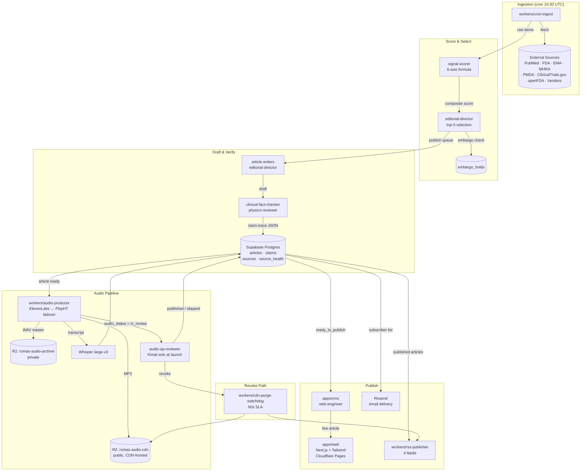
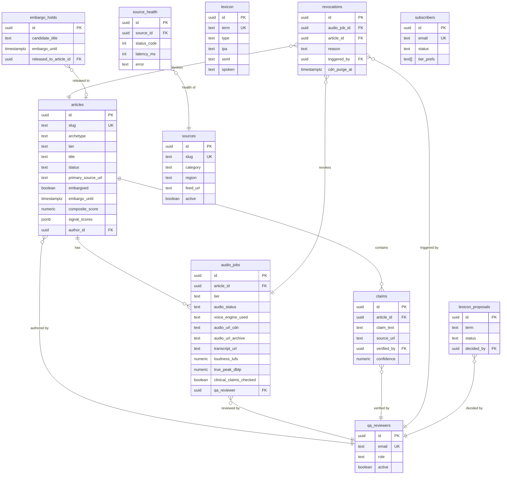

# ROMAS Wire — System Architecture

> Version: 2.0.0 · Date: 2026-05-28 · Owner: Kimal Honour Djam
> ADRs for each tech-stack choice live in `docs/specs/adr/`.
> **Phase 8 consolidation complete** — single-repo architecture as of 2026-05-28. Split-repo contract retired (see `Docs/INTEGRATION-CONTRACT.md` status: EXECUTED).

---

## 1. System Diagram

End-to-end data flow from source ingestion through publish and distribution.



---

## 2. Module Table

| Module | Path | Runtime | Responsibility |
|---|---|---|---|
| `cms` | `apps/cms/` | Next.js 14+ / Cloudflare Pages | Internal editorial dashboard — article CRUD, audio status, QA gate UI |
| `web` (reader) | `apps/web/` | Next.js 14.2.35 + Tailwind / **Vercel** | Public reader surface — 8-module homepage, article pages, AudioPlayer, Listen page, ROMAS Read. **Deployed at https://romas-brief-web.vercel.app**. Source consolidated from `kimhons/romas-brief-web` into this monorepo on 2026-05-28 (Phase 8). |
| `cron-ingest` | `workers/cron-ingest/` | Cloudflare Worker (Node 20 compat) | Scheduled fetch from all source endpoints; writes raw items; logs to source_health |
| `audio-producer` | `workers/audio-producer/` | Cloudflare Worker | ElevenLabs → failover TTS (PlayHT retired, replacement per ADR-0018); loudness mastering; WAV/MP3 upload to R2; Whisper transcript; state flip to in_review |
| `rss-publisher` | `workers/rss-publisher/` | Cloudflare Worker | Generates 4 per-tier RSS feeds on article publish/revoke; validates feed structure |
| `cdn-purge-watchdog` | `workers/cdn-purge-watchdog/` | Cloudflare Worker | Listens for revoke events; purges CDN by tag within 60s SLA; triggers RSS regeneration |
| `shared` | `packages/shared/` | TypeScript strict | Types, constants, signal-scoring formula, state-machine guards, article archetypes |
| `supabase` | `supabase/migrations/` | SQL (Postgres 15) | 11 ordered migrations (0001–0011) — schema + RLS + triggers + seed |
| `audio-tools` | `tools/audio/` | Node 20+ TypeScript | Pre-roll/post-roll templates, loudness verification helpers, lexicon SSML renderer |

---

## 3. Data Model

Derived from `.claude/skills/cms-schema.md`.



---

## 4. Integrations

| Integration | Type | Direction | Purpose | Auth |
|---|---|---|---|---|
| ElevenLabs | REST API | Outbound | Primary TTS — ROMAS Clinical Narrator voice | `ELEVENLABS_API_KEY` + `ELEVENLABS_ROMAS_VOICE_ID` |
| PlayHT | REST API | Outbound | Failover TTS | `PLAYHT_API_KEY` + `PLAYHT_USER_ID` + `PLAYHT_ROMAS_VOICE_ID` |
| Whisper large-v3 | REST/gRPC | Outbound | Audio transcript (TXT + SRT) | `WHISPER_ENDPOINT` |
| openFDA | REST API | Inbound | Device / drug regulatory signals — verified against 510(k) DB before drafting | Public |
| FDA 510(k) / De Novo / PMA DB | REST API | Inbound | Authoritative verification of openFDA hits (Rule 4) | Public |
| EMA | Feed / API | Inbound | EU regulatory signals | Public |
| MHRA | Feed | Inbound | UK regulatory signals | Public |
| PMDA | Feed | Inbound | Japan regulatory signals | Public |
| PubMed | API (E-utilities) | Inbound | Literature & Evidence — PMID-based citation | `PUBMED_API_KEY` (optional, rate limit) |
| ClinicalTrials.gov | API v2 | Inbound | Trial results, NCT-based citation | Public |
| Cloudflare API (cache) | REST | Outbound | CDN tag-based purge on audio revoke (60s SLA) | `CLOUDFLARE_ZONE_ID` + `CF_API_TOKEN` |
| Resend | REST API | Outbound | Daily issue email delivery to subscribers | `RESEND_API_KEY` |
| Supabase | SDK + REST | Bidirectional | Postgres 15 + RLS + Auth — primary data store | `SUPABASE_URL` + `SUPABASE_SERVICE_KEY` |
| Cloudflare R2 | S3-compatible | Outbound | Audio storage — archive (WAV private) + CDN (MP3 public) | `R2_ACCESS_KEY_ID` + `R2_SECRET_ACCESS_KEY` |
| Plausible | Script + API | Outbound | Privacy-first analytics — no PII, no cookies | `PLAUSIBLE_DOMAIN` |

---

## 5. Tech Stack Decisions

| Concern | Chosen | Alternatives Rejected | Reason |
|---|---|---|---|
| Monorepo tooling | pnpm workspaces + Turborepo | npm workspaces, Nx, single-package | See ADR-0001 |
| Database + auth | Supabase (Postgres 15 + RLS) | Neon + Drizzle, Firebase, raw Postgres | See ADR-0002 |
| Edge runtime + CDN + storage | Cloudflare Workers + Pages + R2 | Vercel + S3, Netlify + R2, Fly.io + Tigris | See ADR-0003 |
| TTS | ElevenLabs primary + PlayHT failover | Azure TTS, Google Cloud TTS, OpenAI TTS | See ADR-0004 |
| RSS distribution | 4-tier feeds (audio-brief, daily-brief, podcast, conference-brief) | Single feed + tags, per-article feeds | See ADR-0005 |
| Audio QA enforcement | Schema-enforced state machine | App-layer only, manual publish, two-person from day 1 | See ADR-0006 |
| Language | TypeScript strict, Node 20+ | Python, Go | Clinical trust context demands type safety at every layer |
| Email | Resend | Postmark, Beehiiv | Resend: developer-first, transactional-only pricing, CLAUDE.md §7 + AGENT.md §15 authoritative; Runbook reference to Beehiiv is superseded |
| Analytics | Plausible | Google Analytics, Mixpanel, PostHog | Privacy-first, no cookies, clinical audience trust |
| Search | Postgres full-text + pgvector | Algolia, Typesense, Elasticsearch | Already in Supabase; avoids additional vendor; pgvector enables semantic search |
| Frontend framework | Next.js 14+ App Router | Remix, Astro, SvelteKit | Locked: CLAUDE.md §7 |
| Styling | Tailwind CSS | CSS Modules, styled-components | Locked: CLAUDE.md §7 |
| Transcript | Whisper large-v3 | Deepgram, AssemblyAI | Self-hosted transcript avoids PHI-adjacent audio leaving infrastructure boundary |

---

## 6. Cross-Cutting Concerns

### Secrets Management

| Secret type | Storage | Access pattern |
|---|---|---|
| TTS API keys | Cloudflare Secrets (Workers) | Bound at deploy time; never in code |
| Supabase service key | Cloudflare Secrets | Server-side workers only; anon key for public reader |
| R2 credentials | Cloudflare Secrets | Workers only; never in client bundle |
| Resend API key | Cloudflare Secrets | Email worker only |
| Whisper endpoint | Cloudflare Secrets | audio-producer worker only |

Supabase Vault available for application-level secret rotation without redeployment.

### Observability

| Concern | Tool | Notes |
|---|---|---|
| Worker metrics + logs | Cloudflare Workers Analytics Engine | Request latency, error rates, cron timing |
| Error tracking | Sentry (hypothesis — awaiting Kimal confirmation) | Client + server-side error capture |
| Analytics | Plausible | Page views, referrers, no PII |
| Audio QA audit trail | `audio_jobs` + `revocations` tables | Schema-level; append-only via RLS |
| Source health | `source_health` table | Daily fetch result per source; surfaced in morning brief |

### Accessibility

Target: WCAG 2.2 AA across `apps/web` and `apps/cms`.

- AudioPlayer: keyboard-navigable play/pause/seek, ARIA live regions for status changes.
- Audio status colors (`--rb-audio-published`, `--rb-audio-pending`, `--rb-audio-skipped`) must meet 4.5:1 contrast ratio against background.
- `design-system-keeper` subagent owns accessibility compliance gate.
- Sponsor firewall: no sponsor element within 32px of ROMAS Wire wordmark (visual + DOM distance check).

### Performance

| Target | Spec | Enforcement |
|---|---|---|
| LCP | < 2.5s | Cloudflare Pages CDN + Next.js image optimization |
| CDN TTL — active audio | 300s | `Cache-Control: max-age=300` on R2 CDN bucket |
| CDN TTL — archived audio (>24h) | 86400s | Worker sets header based on publish date |
| Revoke CDN withdrawal | ≤ 60s | `cdn-purge-watchdog` worker, tag-based purge |
| Supabase pool | pgBouncer (Supabase default) | Session mode for Workers |

---

## 7. Decision Log

Full rationale in each ADR. Summary:

| ADR | Title | Status | Date |
|---|---|---|---|
| [ADR-0001](adr/0001-monorepo-pnpm-turborepo.md) | pnpm workspaces + Turborepo | Proposed (hypothesis) | 2026-05-14 |
| [ADR-0002](adr/0002-supabase-postgres-rls.md) | Supabase + Postgres 15 + RLS | Accepted (retroactive) | 2026-05-14 |
| [ADR-0003](adr/0003-cloudflare-workers-pages-r2.md) | Cloudflare Workers + Pages + R2 | Accepted (retroactive) | 2026-05-14 |
| [ADR-0004](adr/0004-tts-elevenlabs-primary-playht-failover.md) | ElevenLabs primary + PlayHT failover | Accepted (retroactive) | 2026-05-14 |
| [ADR-0005](adr/0005-rss-four-tier-feeds.md) | Four-tier RSS feeds | Accepted (retroactive) | 2026-05-14 |
| [ADR-0006](adr/0006-audio-qa-state-machine.md) | Schema-enforced audio QA state machine | Accepted (retroactive) | 2026-05-14 |

---

## 8. Deployment State (as of 2026-05-28)

| Surface | Host | URL | Status |
|---|---|---|---|
| Reader (`apps/web`) | Vercel (team: alien-nova) | https://romas-brief-web.vercel.app | **LIVE** — 8-module homepage, 79/79 pages |
| CMS (`apps/cms`) | Not yet deployed | — | Scaffold only |
| Workers | Not yet deployed | — | Source in `workers/`; Cloudflare deployment pending |
| Supabase | Supabase cloud | `rjpuxfbuzispklcstuzo` | Schema ready; reader still on mock data |

**Vercel project:** `romas-brief-web` (ID: `prj_U86mInvLI5mRyv6zjPIwh2Aryi`)
**GitHub source:** `kimhons/romas-brief-web` (repoId: `1252164491`) — Vercel is currently linked to this standalone repo which mirrors the consolidated `apps/web/` source. Re-linking to `AllienNova/romas-brief` with `rootDirectory=apps/web` is a pending T-805 follow-up task.

**Deploy command (manual — GitHub auto-deploys blocked due to billing):**
```bash
TOKEN="$VERCEL_TOKEN"   # set in your shell/CI; NEVER commit. The previously-committed vcp_… token was leaked and MUST be rotated (team-qa P0).
TEAM="$VERCEL_TEAM_ID"
curl -s -X POST "https://api.vercel.com/v13/deployments?teamId=$TEAM" \
  -H "Authorization: Bearer $TOKEN" \
  -H "Content-Type: application/json" \
  -d '{"name":"romas-brief-web","gitSource":{"type":"github","repoId":1252164491,"ref":"main"},"target":"production"}'
```

---

*Architecture doc — update in the same PR as any module boundary change.*
