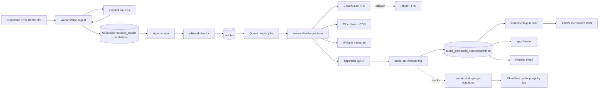

# Codebase Index — ROMAS Brief

## Stack (target)

- **Language**: TypeScript strict everywhere (`tsconfig.base.json` planned in M1)
- **Runtime**: Node 20+ (workers/scripts), Bun 1.x optional for local dev
- **Monorepo**: pnpm workspaces + Turborepo *(ADR-0001, hypothesis)*
- **Framework**: Next.js 14 (App Router) for `apps/reader` and `apps/cms`
- **DB**: Supabase (Postgres 15 + pgvector + RLS)
- **Edge**: Cloudflare Workers + Pages + R2
- **Test**: Vitest + Playwright + pgTAP *(ADR-0009)*
- **Lint/Format**: ESLint + Prettier
- **CI/CD**: GitHub Actions + Wrangler + Supabase CLI *(ADR-0010)*

## Code state

**None.** No `package.json`, `pnpm-workspace.yaml`, `wrangler.toml`, `supabase/migrations/`, or app source files exist. This is greenfield.

## Planning kit on disk (the "code" today)

### Project root (`D:/dev/projects/ROMAS/ROMAS BRIEF/`)

| Path | Purpose |
|---|---|
| `CLAUDE.md` | Session-level project context (~440 lines). Locked decisions, six inviolable rules, audio architecture, tech stack, agents+skills index. |
| `AGENT.md` | Operating manual (~250 lines). Daily loop, state machines, decision log, escalation table, anti-patterns. |
| `README.md` | Top-level overview + companion-doc index. |

### `Docs/`

| Path | Purpose | Version on disk | Version in CLAUDE.md §6 |
|---|---|---|---|
| `ROMAS-Brief-Master-Strategy.md` | Strategy + system map | **v2.0** | v2.1 (DRIFT) |
| `ROMAS-Brief-Daily-Production-Runbook.md` | Daily editorial workflow | **v1.0** | v1.1 (DRIFT) |
| `ROMAS-Brief-500-Article-Launch-Plan.md` | Audio ramp + readiness gates | **v1.0** | v1.1 (DRIFT) |
| `ROMAS-Brief-Design-Specification.md` | UI/component/token spec | **ABSENT** | v1.1 (REQUIRED) |
| `ROMAS-Brief-Audio-Architecture.md` | TTS pipeline / RSS / QA gate detail | **ABSENT** | v1.0 (REQUIRED) |
| `ROMAS-Wire-Master-Strategy.md` + `(1).md` + `(2).md` | RETIRED brand — 3 byte-identical duplicates | v1.0 | n/a (DELETE — M0-T-005) |
| `Research/deep-research-report*.md` (3 files) | Research raw materials | — | n/a |

### `.claude/agents/` (13 files, all match CLAUDE.md §10)

`editorial-director.md` · `clinical-fact-checker.md` · `physics-reviewer.md` · `regulatory-analyst.md` · `signal-scorer.md` · `audio-producer.md` · `audio-qa-reviewer.md` · `rss-publisher.md` · `cms-engineer.md` · `web-engineer.md` · `design-system-keeper.md` · `friday-read-editor.md` · `conference-mode-operator.md`

### `.claude/skills/` (14 files, all match CLAUDE.md §10)

`editorial-style-guide.md` · `audio-production-pipeline.md` · `audio-qa-checklist.md` · `pronunciation-lexicon.md` · `rss-feed-spec.md` · `cms-schema.md` · `design-tokens.md` · `component-library.md` · `signal-scoring.md` · `source-ingestion.md` · `embargo-handling.md` · `friday-read-format.md` · `conference-brief-mode.md` · `claim-verification.md`

### `.claude/commands/` (8 files)

`morning-brief.md` · `audio-qa.md` · `verify-claims.md` · `score-candidates.md` · `friday-read.md` · `conference-day.md` · `revoke-audio.md` · `new-migration.md`

### `.claude/agent-memory/`

Empty at index time. Will hold cross-session state for editorial-director and conference-mode-operator (M1).

## Entry points (planned)

| Path | Role | Activates |
|---|---|---|
| `workers/cron-ingest/src/index.ts` | Cron trigger `30 10 * * 1-5` UTC | M1 |
| `workers/audio-producer/src/index.ts` | Queue-triggered or fetch-triggered | M2 |
| `workers/rss-publisher/src/index.ts` | On `audio_jobs` status change | M2 |
| `workers/cdn-purge-watchdog/src/index.ts` | Cron `* * * * *` (every minute) | M2 |
| `apps/reader/app/page.tsx` | Reader homepage | M3 |
| `apps/cms/app/page.tsx` | CMS dashboard (Access-gated) | M2 |
| `supabase/migrations/0001_init_articles.sql` | First migration | M1 |

## Module map (target post-M1)

| Path | Responsibility | Public surface | Key deps | LoC est | Test owner |
|---|---|---|---|---|---|
| `apps/reader` | Public reader + AudioPlayer + Listen page | HTTPS routes | next, tailwind, packages/shared | 2,500 | Playwright + visual |
| `apps/cms` | Internal CMS, QA UI, audio QA flip | HTTPS routes (Access-gated) | next, tailwind, packages/db | 3,000 | Playwright |
| `workers/cron-ingest` | Mon-Fri 10:30 UTC ingest | Cron + queue producer | hono, packages/db, packages/shared | 800 | Vitest integration |
| `workers/audio-producer` | TTS + master + R2 upload | Queue consumer | hono, ffmpeg-wasm, R2, packages/audio | 1,200 | Vitest integration |
| `workers/rss-publisher` | Per-tier feed generation | HTTP + queue consumer | hono, packages/rss | 600 | Vitest unit + xmllint |
| `workers/cdn-purge-watchdog` | 60s revoke SLA watchdog | Cron every minute | hono, packages/db, Cloudflare API | 200 | Vitest integration |
| `packages/db` | Generated Supabase types + query helpers | TS exports | @supabase/supabase-js | 1,000 | Vitest unit |
| `packages/shared` | Signal scoring, slug, embargo logic, lexicon helpers | TS exports | (none) | 1,500 | Vitest unit (100% coverage target) |
| `packages/audio` | ffmpeg loudnorm wrapper, lexicon application, pre-roll | TS exports | ffmpeg-wasm, R2 client | 800 | Vitest unit + integration |
| `packages/rss` | Feed builders + validators | TS exports | xml | 500 | Vitest unit + xmllint |
| `packages/test-fixtures` | Golden article, factories, seeded fixtures | TS exports | faker | 400 | (consumer-tested) |
| `supabase/migrations` | 10 SQL files | SQL → DB | — | 1,200 SQL | pgTAP |

**Total LoC estimate post-M5**: ~14,000 lines TS + 1,200 SQL.

## Data flow (target)

## Hotspots (target — areas to watch)

- **`packages/audio`**: ffmpeg-wasm + loudnorm two-pass + R2 streaming is the highest-risk path. Loudness measurement must be deterministic; integration tests with golden WAVs.
- **`workers/audio-producer`**: ElevenLabs ↔ PlayHT failover state must not silently swap mid-issue (audio-production-pipeline.md:98).
- **`workers/cdn-purge-watchdog`**: 60s SLA depends on Cloudflare cache-purge-by-tag working reliably; deserves load test before launch.
- **`packages/db` + RLS policies**: service-role keys bypass RLS (cms-schema.md:283-307 illustrative only); subscriber count must be app-layer-guarded.
- **`apps/cms` audio QA flip**: the inviolable Rule 6 endpoint. Schema enforces the gate; UI must not present a shortcut.

## Dead or quarantined code

| Path | Evidence | Action |
|---|---|---|
| `Docs/ROMAS-Wire-Master-Strategy.md` | Retired brand per Master Strategy v2.0 §1; byte-identical to (1).md and (2).md | Move to `Docs/ARCHIVE/` with RETIRED notice (M0-T-005) |
| `Docs/ROMAS-Wire-Master-Strategy (1).md` | Duplicate of above | Same |
| `Docs/ROMAS-Wire-Master-Strategy (2).md` | Duplicate of above | Same |

## Documentation density

| Surface | Files | Total lines (est) |
|---|---|---|
| Top-level docs | 3 | 700 |
| Strategy/Runbook/Launch | 3 | 1,200 |
| ARCHIVE candidates | 3 | 1,150 (3 × ~380, all identical) |
| Research | 3 | 3,200 |
| Agents | 13 | 4,800 |
| Skills | 14 | 6,200 |
| Commands | 8 | 580 |
| **Subtotal** | **47** | **~17,800 lines** |
| Specs added in this planning session (`docs/specs/`) | 20+ | TBD post-write |
| **Total** | **~67+** | **~22,000+** |

## Revision history

| Date | Version | Change |
|---|---|---|
| 2026-05-14 | 1.0.0 | Initial index. Repo is code-empty; index covers planning kit. |
