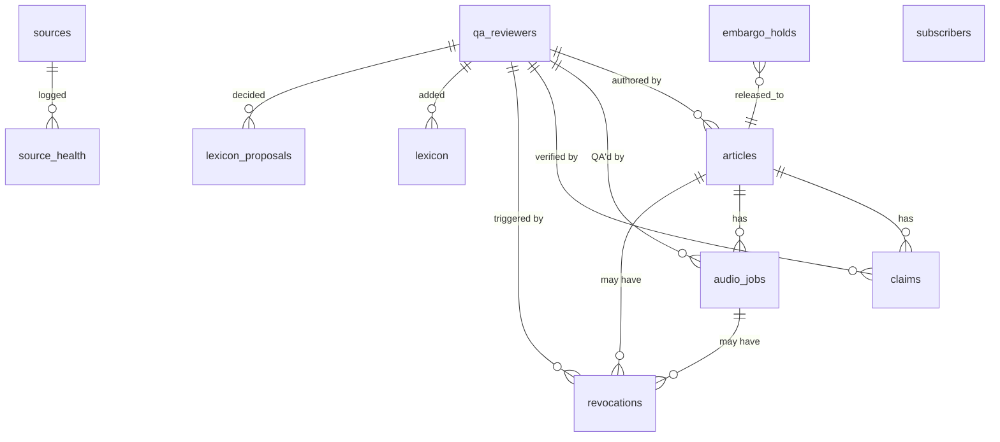

# Current Architecture — ROMAS Brief

## 0. State at index time

- **Code**: none.
- **Database**: not provisioned (Supabase project not yet created).
- **Workers**: not deployed.
- **Reader / CMS**: not built.
- **What exists**: planning + operating contracts (CLAUDE.md, AGENT.md, 5 strategy docs, 13 agents, 14 skills, 8 commands).

The "current architecture" is therefore the **documented workflow contract** — the rules every future code change must satisfy.

## 1. Documented system shape

```mermaid
flowchart TB
  subgraph Editorial Layer (documented, not implemented)
    EDir[editorial-director]
    FactCheck[clinical-fact-checker]
    Physics[physics-reviewer]
    Reg[regulatory-analyst]
    Scorer[signal-scorer]
    Embargo[embargo-handling skill]
  end

  subgraph Audio Layer (documented, not implemented)
    AudioProd[audio-producer]
    QA[audio-qa-reviewer]
    Lex[pronunciation-lexicon]
    Pipeline[audio-production-pipeline]
  end

  subgraph Publishing Layer (documented, not implemented)
    RSS[rss-publisher]
    Web[web-engineer]
    Design[design-system-keeper]
  end

  subgraph Infrastructure (planned, not provisioned)
    CMS[cms-engineer / Supabase]
    CDN[Cloudflare R2 + Pages + Workers]
    Email[Resend]
    TTS[ElevenLabs + PlayHT]
  end

  EDir --> FactCheck
  EDir --> Physics
  EDir --> Reg
  EDir --> Scorer
  EDir --> AudioProd
  AudioProd --> Pipeline
  AudioProd --> Lex
  AudioProd --> QA
  QA --> RSS
  QA --> Web
  Web --> CDN
  RSS --> CDN
  EDir --> CMS
  AudioProd --> TTS
  Web --> Email
```

## 2. Workflow contracts (already locked)

| Contract | Source | Lock status |
|---|---|---|
| Daily loop with 9 phases + timings | AGENT.md §3 | Locked |
| Article state machine: `draft → in_review → ready_to_publish → published → (revoked \| corrected)` | AGENT.md §12 | Locked |
| Audio state machine: `queued → generating → in_review → (published \| skipped); published → revoked` | AGENT.md §12 | Locked |
| Audio publish gate (4 conditions) | AGENT.md §12 + cms-schema.md:96-103 | Schema-enforced |
| Six-axis signal scoring with locked weights | AGENT.md §8, signal-scoring skill, 4 docs | Locked |
| Article archetypes (3) with word + audio length mapping | AGENT.md §6, audio-production-pipeline.md:16-22 | Locked |
| Audio Brief 10-beat structure | AGENT.md §7, audio-production-pipeline.md:24-39 | Locked |
| Source attribution chain (openFDA → official record) | AGENT.md §5 Rule 4, regulatory-analyst agent | Locked |
| Six inviolable rules | CLAUDE.md §4, AGENT.md §5 | Locked (canonical wording per SSOT §2) |
| Locked decisions ledger v2.1 (14 items) | SSOT.md §3 | Locked |

## 3. Data model (documented in `.claude/skills/cms-schema.md`)

11 entities, all in Supabase Postgres:



Schema-enforced invariants (cms-schema.md:347-352):

1. `articles.primary_source_url NOT NULL` (Rule 1)
2. `audio_jobs.audio_status = 'published'` requires QA pass (Rule 6) — CHECK constraint at lines 96-103
3. `articles.embargoed = true` requires `embargo_until` (Rule 2) — `articles_embargo_consistency` CHECK
4. `articles.romas_insight NOT NULL` requires `romas_insight_labeled = true` (Rule 3) — `articles_insight_labeled` CHECK

## 4. Integrations (documented contract, no client code yet)

| Service | Doc reference | Auth | Failure mode |
|---|---|---|---|
| ElevenLabs TTS | audio-production-pipeline.md:9-10 + 92-97 | API key (env `ELEVENLABS_API_KEY`) | 3 retries (1/4/16s backoff) → PlayHT failover |
| PlayHT TTS | audio-production-pipeline.md:11 + 93-97 | API key + user ID | Skip audio, ship article without audio |
| Whisper | audio-production-pipeline.md:7,57 + env `WHISPER_ENDPOINT` | endpoint-specific | Block publish (transcript URL mandatory) |
| Cloudflare R2 | audio-production-pipeline.md:100-115 | `R2_ACCESS_KEY_ID` + `R2_SECRET_ACCESS_KEY` | Retry, log |
| Cloudflare cache-purge | audio-production-pipeline.md:118, 129; CLAUDE.md §5 revoke SLA | API token + `CLOUDFLARE_ZONE_ID` | Watchdog alert if `cdn_purge_at` null >90s (NEW) |
| Resend | CLAUDE.md §7, AGENT.md §15 line 242 | API key | Retry + dead-letter |
| Supabase | CLAUDE.md §7, cms-schema | service-role key (Workers only) + anon key (public RLS) | Standard `@supabase/supabase-js` |
| openFDA | regulatory-analyst.md | none (public) | Log to `source_health`, retry next cycle |
| FDA 510(k) / De Novo / PMA | regulatory-analyst.md, Rule 4 | none (public) | Required for verification step; cannot publish without |
| EMA, MHRA, PMDA, NMPA, TGA, Health Canada | source-ingestion skill | varies, public | Per-source log + fallback chain |
| PubMed, ClinicalTrials.gov, medRxiv, arXiv | source-ingestion skill | NCBI eutils key (optional) | Log + retry |

## 5. Cross-cutting concerns (documented intent)

| Concern | Documented intent | Implementation status |
|---|---|---|
| Secrets | `.env` for local dev, Cloudflare Secrets + Supabase Vault for prod | Not yet — no `.env.example`, no `SECRETS.md` |
| RLS | Enabled on every table; public reads `published` only; editors read all | Documented in cms-schema.md:283-307 |
| Observability | Cron success rates + audio failure counts + RSS validation pass rates | Undocumented — Q5 hypothesis: Workers Analytics Engine + Sentry |
| Accessibility | WCAG 2.2 AA per design-system-keeper | Documented; tooling (pa11y/axe-core) TBD M3 |
| Performance | LCP < 2.5s, INP < 200ms, CLS < 0.1 | Documented; benchmark in M3 |
| HIPAA | Not applicable (no PHI); ToS "No PHI" clause required | Documented in Master Strategy §7.1 |
| GDPR | Email minimization, right to erasure; DPAs with vendors | Partially documented; vendor DPA inventory TBD M1 |
| Voice consent | ElevenLabs custom voice + PlayHT clone — consent scope undocumented | **Gap** — voice-consent-registry.md to author in M1 |

## 6. Operational contracts (already in agent definitions)

- **`editorial-director`**: source ingestion → dedupe → scoring → top-5 → fact-check dispatch → audio dispatch → publish. Owns Rule 5.
- **`audio-qa-reviewer`**: sole authority to flip `audio_status = published`. Also sole revoke authority.
- **`cms-engineer`**: migrations, RLS, triggers. Cannot apply to prod within publish window (AGENT.md §11).
- **`design-system-keeper`**: token discipline, accessibility, sponsor firewall.
- **`conference-mode-operator`**: activation per supported conference; embargo lint.
- **`friday-read-editor`**: sub-rubric rotation (currently missing `friday_read_history.json` + `friday_read_predictions.json` — finding H-11).

## 7. Drift between documents (auditable today)

These are the documented contradictions that the SSOT v1.0.0 resolves:

| Drift | Documents involved | SSOT resolution |
|---|---|---|
| Tagline | CLAUDE.md §2 vs Master Strategy v2.0 §1 | "Radiation oncology, decoded daily." (Q1) |
| Podcast launch | CLAUDE.md §3 vs §5 vs AGENT.md §3 vs §13 vs friday-read-format.md:21 | Day 14 = Daily Brief; Day 30–45 = Podcast (Q2) |
| Email platform | Runbook lines 67, 196 vs CLAUDE.md §7 vs AGENT.md §15 | Resend (Q3) |
| Inviolable rules count | CLAUDE.md (6) vs Master Strategy §6.1 (5) vs Runbook §6 (5) | Six, with canonical wording in SSOT §2 |
| Doc versions | CLAUDE.md §6 (v2.1, v1.1, v1.1) vs disk (v2.0, v1.0, v1.0) | Bump on-disk versions to match CLAUDE.md |
| Companion docs | CLAUDE.md §6 lists Design Spec v1.1 + Audio Architecture v1.0 | Neither exists; author in M1 |

## 8. What "current architecture" lacks

- No code (apps, workers, packages) — entire scaffold absent
- No CI pipeline
- No environments (preview/staging/prod not provisioned)
- No secrets store wired
- No observability
- No tests (no test framework selected on disk — Vitest is proposed by ADR-0009)
- No deploy automation
- No rollback procedure
- No on-call rota (Kimal solo at launch is documented but no rotation tooling)

These are addressed in `MASTER_IMPLEMENTATION_PLAN.md` Phases B–D (M1–M3).

## Revision history

| Date | Version | Change |
|---|---|---|
| 2026-05-14 | 1.0.0 | Initial current-architecture snapshot. Code-empty repo; this is the planning-kit-as-contract baseline. |
