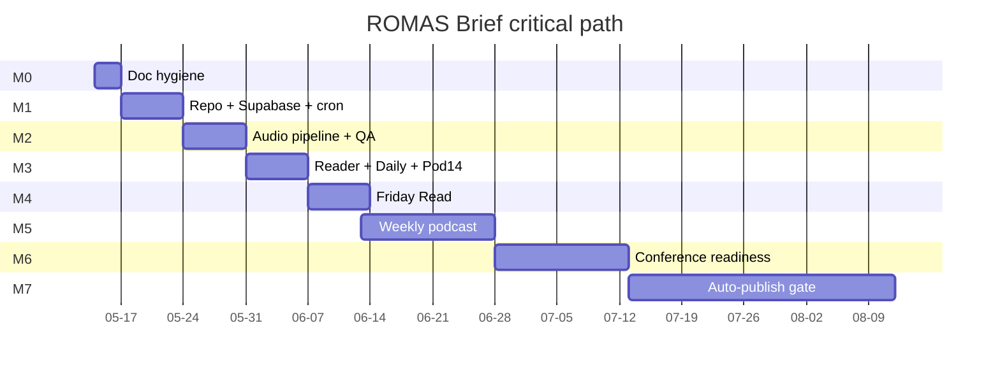

# ROMAS Brief — Delivery Plan

**Version:** 1.1.0 (cycle-2 scope lock)
**Date:** 2026-05-14
**Owner:** Kimal Honour Djam (president@aliennova.com)
**Persona producing this doc:** Delivery Lead (/team-plan)
**Companion docs:** `docs/MASTER_IMPLEMENTATION_PLAN.md`, `docs/specs/test-qa-plan.md`, `Docs/ROMAS-Brief-500-Article-Launch-Plan.md` v1.1

---

## CYCLE-2 SCOPE LOCK (2026-05-14, Kimal)

This plan was authored in cycle-1 with a staggered audio launch (Audio Brief Day 0 / Daily Brief Day 14 / Podcast Day 30–45 / Conference Brief Day 60) and Resend-only email. **Kimal verbally locked a more ambitious scope on 2026-05-14:**

| Lock | What changed | Impact on milestones below |
|---|---|---|
| **Q1 tagline** | "Radiation oncology, decoded daily." re-affirmed | None (already locked) |
| **Q2 audio architecture** | All 4 audio tiers launch **Day 1** via ElevenLabs (Audio Brief + Daily Brief + Audio Podcast + Conference Brief feeds all live Day 1) | M2 expands to include Tier 2 (Daily Brief), Tier 3 (Podcast), Tier 4 (Conference) generators. M3 narrows: audio is no longer M3 scope. M5 (was "weekly Podcast launch Day 30–45") **DISSOLVED** — its tasks fold into M2 |
| **Q2-A first podcast episode cadence** | Option (a): Day 1 ships a full 30–60 min Audio Podcast episode 001 (needs 4,500–9,000 word script written, fact-checked, lexicon-applied, ElevenLabs-mastered, QA'd before Day 1) | New T-225..T-230 in M2 for Podcast episode 001 production. R-16 new risk: Day-1 podcast script production burden |
| **Q2 video addendum** | New Tier 5 — **Video Podcast with invited human guest** — launches **Day 60** | New M6.5 inserted (between M6 Conference Brief and M7 Auto-publish graduation). Tasks T-651..T-660 cover video studio, guest booking, recording, editing, hosting (vendor TBD ADR-0012), `video-podcast.xml` feed, reader Watch page |
| **Q3 email split** | Beehiiv (newsletter: daily issue, Friday Read, podcast/conference notifications) + Resend (transactional: signup, unsubscribe receipt, audio-revocation notice, password reset). Subscriber list canonical on Beehiiv; Supabase mirrors via webhook | M3 split: T-310 becomes T-310 (Beehiiv issue send) + T-310A (Resend transactional) + T-310C (workers/beehiiv-webhook) + T-310D (daily reconciliation). R-15 risk expands to two-vendor. R-17 new risk: Beehiiv-Supabase sync drift |

**Task IDs unchanged** for cycle-1 numbering (referenced in test-qa-plan A-NNN catalog + remediation-plan R-NNN); new tasks use unused IDs (T-225..T-230, T-310A..T-310D, T-651..T-660). All section §1 "Goal" wording below describes the cycle-1 phasing — the cycle-2 lock above supersedes any conflict.

---

## 1. Goal

Ship ROMAS Brief — the public media surface of ROMAS Intelligence — as a daily weekday brief with a 4-tier audio architecture, primary-source discipline, and a non-negotiable editorial QA gate, within a 60-day cut-line from `Day -7` (repo scaffold) through `Day 60` (Conference Brief readiness + auto-publish graduation review). M0 burns down the 19 findings from /team-review (7 Critical + 4 High + 8 Medium/Low) before any code lands; M1 lays foundation; M2 brings the Audio Brief tier live with the QA gate enforced; M3 launches the public reader, Daily Brief tier, and Podcast tier on Day 14 (hypothesis — awaiting Kimal confirmation); M4 wires Friday Read; M5 launches the weekly Podcast on Day 30 (hypothesis — awaiting Kimal); M6 readies Conference Brief; M7 is the protocol gate for any future auto-publish graduation.

---

## 2. Milestones

| ID | Name | Window | Outcome |
|---|---|---|---|
| M0 | Doc hygiene | Day -3 → Day -1 | All 7 Critical + 4 High audit findings closed at doc level |
| M1 | Repo scaffold + DB + first cron | Day -7 → Day 0 | pnpm/Turborepo monorepo green; Supabase migrations 0001–0010 applied; first ingestion Worker emits raw items JSON; Resend test send succeeds; GitHub Actions CI green |
| M2 | Audio pipeline + QA gate + Audio Brief tier | Day 0 → Day 7 | TTS workers wired (ElevenLabs primary, PlayHT failover); pronunciation lexicon seeded (30 entries); CMS Audio QA UI live; `audio-brief.xml` validated; CDN purge watchdog passes 60s revoke test; voice consent registry populated; AudioPlayer Variants A and B ship behind flag |
| M3 | Web reader + Daily Brief tier + Podcast Day 14 | Day 8 → Day 14 | Public reader live (Next.js + Tailwind on Cloudflare Pages); Listen page renders 4 tiers; `daily-brief.xml` valid; email issue dispatches via Resend; `podcast.xml` minimal podcast tier live (hypothesis — awaiting Kimal) |
| M4 | Friday ROMAS Read + sub-rubric rotation | Day 15 → Day 21 | `friday-read-editor` subagent wired; `friday_read_history.json` and `friday_read_predictions.json` scaffolded; first Friday issue lands |
| M5 | Weekly Podcast tier launch | Day 30 → Day 45 | Tier 3 full-fat weekly podcast launched (hypothesis — Day 30 hard target awaiting Kimal); chapter markers + show notes + Apple/Spotify directory submission |
| M6 | Conference Brief tier readiness | Day 45 → Day 60 | Embargo-aware live mode; `conference-brief.xml` valid; dry-run against next ASTRO/ESTRO/AAPM date in calendar |
| M7 | Auto-publish graduation review | Day 60 → ongoing | Decision protocol only — gated by ≥60 days of editorial correction rate <1%; requires Kimal sign-off in `AGENT.md §13` |

---

## 3. Task breakdown by team

Owner-role codes match `.claude/agents/`: `cms-engineer`, `web-engineer`, `audio-producer`, `audio-qa-reviewer`, `rss-publisher`, `design-system-keeper`, `editorial-director`, `regulatory-analyst`, `friday-read-editor`, `conference-mode-operator`. Estimate codes: S = <1 day, M = 1–3 days, L = 3–8 days. Acceptance IDs (`A-NNN`) map to `docs/specs/test-qa-plan.md`.

### 3.1 M0 — Doc hygiene (close audit findings)

| ID | Title | Owner | Est | Depends on | Accept test |
|---|---|---|---|---|---|
| T-001 | Resolve Q1 tagline ambiguity — confirm "Radiation oncology, decoded daily." everywhere; remove competing variants from `Master-Strategy.md`, `Design-Specification.md` (hypothesis — awaiting Kimal) | editorial-director | S | — | A-001 |
| T-002 | Resolve Q2 podcast-Day-14 vs Day-30 — record decision in `AGENT.md §13` decision log; update Launch Plan §8 (hypothesis — awaiting Kimal) | editorial-director | S | — | A-002 |
| T-003 | Resolve Q3 email vendor — set Resend as canonical, strike Beehiiv references from Launch Plan §8 and runbook (hypothesis — awaiting Kimal) | editorial-director | S | — | A-003 |
| T-004 | Fix doc-level contradictions on `audio_status` enum (`in_review`/`published`/`skipped`/`revoked` only) across all four companion docs | design-system-keeper | S | — | A-004 |
| T-005 | Add 32px sponsor-firewall measurement rule to Design Spec v1.1 figure references | design-system-keeper | S | — | A-005 |
| T-006 | Add voice-consent registry requirement to Audio Architecture doc | audio-producer | S | — | A-006 |
| T-007 | Add CDN revocation 60s SLA budget to Audio Architecture + Runbook | audio-producer | S | — | A-007 |
| T-008 | Add EU-subscriber GDPR note to Master Strategy (no PHI but personal email + listening telemetry covered) | editorial-director | S | — | A-008 |
| T-009 | Strike all "scrape" instances from any companion doc; replace with collect/extract/gather/fetch | design-system-keeper | S | — | A-009 |
| T-010 | Strike emoji and hype words from all companion docs (anti-pattern enforcement) | design-system-keeper | S | — | A-010 |
| T-011 | Add explicit primary-source-URL field requirement to article schema description in `cms-schema.md` | cms-engineer | S | — | A-011 |

### 3.2 M1 — Repo scaffold + DB + first cron

| ID | Title | Owner | Est | Depends on | Accept test |
|---|---|---|---|---|---|
| T-101 | Initialise pnpm + Turborepo monorepo skeleton (`apps/web`, `apps/cms`, `workers/`, `packages/ui`, `packages/config`) | web-engineer | M | T-001..T-011 | A-101 |
| T-102 | Add `tsconfig.base.json` with strict mode + path aliases | web-engineer | S | T-101 | A-102 |
| T-103 | Apply Supabase migration 0001 — `articles` table | cms-engineer | M | T-101 | A-103 |
| T-104 | Apply Supabase migration 0002 — `audio_jobs` table with state machine constraints | cms-engineer | M | T-103 | A-104 |
| T-105 | Apply Supabase migration 0003 — `sources` table | cms-engineer | S | T-103 | A-105 |
| T-106 | Apply Supabase migration 0004 — `claim_trace` table | cms-engineer | S | T-103 | A-106 |
| T-107 | Apply Supabase migration 0005 — `embargo_hold` table | cms-engineer | S | T-103 | A-107 |
| T-108 | Apply Supabase migration 0006 — `signal_scores` table | cms-engineer | S | T-103 | A-108 |
| T-109 | Apply Supabase migration 0007 — `pronunciation_lexicon` table | cms-engineer | S | T-103 | A-109 |
| T-110 | Apply Supabase migration 0008 — `voice_consent_registry` table | cms-engineer | S | T-103 | A-110 |
| T-111 | Apply Supabase migration 0009 — `subscribers` table (Resend hand-off) | cms-engineer | S | T-103 | A-111 |
| T-112 | Apply Supabase migration 0010 — `source_health` table | cms-engineer | S | T-103 | A-112 |
| T-113 | Author RLS policies for `articles`, `audio_jobs`, `subscribers`, `voice_consent_registry` | cms-engineer | M | T-104,T-110,T-111 | A-113 |
| T-114 | Author `wrangler.toml` for `workers/ingestion-cron` with cron trigger `30 10 * * 1-5` | web-engineer | S | T-101 | A-114 |
| T-115 | Implement first ingestion Worker (literature + regulatory layers) → raw items JSON to R2 | web-engineer | L | T-114,T-105,T-112 | A-115 |
| T-116 | Wire Resend test endpoint + send canary issue to internal address | web-engineer | S | T-101 | A-116 |
| T-117 | GitHub Actions CI — lint (ESLint), typecheck (tsc), test (vitest), build (turbo build) | web-engineer | M | T-101..T-116 | A-117 |
| T-118 | Secrets management — Cloudflare Workers secrets + Supabase service-role separation; documented rotation policy | cms-engineer | S | T-101 | A-118 |
| T-119 | Observability baseline — Plausible site + structured Worker logs to Logflare/Axiom | web-engineer | S | T-115 | A-119 |
| T-120 | Source-health daily report generator (writes to `source_health` table) | regulatory-analyst | M | T-115,T-112 | A-120 |
| T-121 | Embargo hold list bootstrap (pre-publish reject path) | regulatory-analyst | S | T-107 | A-121 |
| T-122 | Color token v1.1 commit (`--rb-audio-published/-pending/-skipped`) into `packages/ui` | design-system-keeper | S | T-101 | A-122 |
| T-123 | M1 done-definition review with Kimal | editorial-director | S | T-101..T-122 | A-123 |

### 3.3 M2 — Audio pipeline + QA gate + Audio Brief tier

| ID | Title | Owner | Est | Depends on | Accept test |
|---|---|---|---|---|---|
| T-201 | Pronunciation lexicon seed (30 entries) loaded into `pronunciation_lexicon` | audio-producer | S | T-109 | A-201 |
| T-202 | TTS Worker — ElevenLabs primary path (uses `ELEVENLABS_ROMAS_VOICE_ID`) | audio-producer | L | T-104,T-201 | A-202 |
| T-203 | TTS Worker — PlayHT failover path (clone voice ID) | audio-producer | M | T-202 | A-203 |
| T-204 | Loudness master — target -16 LUFS / -1 dBTP via ffmpeg loudnorm | audio-producer | M | T-202 | A-204 |
| T-205 | 10-beat script generator from article body (mandatory beat order) | audio-producer | M | T-202 | A-205 |
| T-206 | Pre-roll injection (Audio Brief opener) | audio-producer | S | T-204 | A-206 |
| T-207 | Master WAV → R2 `romas-audio-archive` (private) | audio-producer | S | T-204 | A-207 |
| T-208 | Public MP3 → R2 `romas-audio-cdn` (Cloudflare CDN) | audio-producer | S | T-207 | A-208 |
| T-209 | CMS Audio QA UI — state-machine flip controls; enforces `clinical_claims_checked = true` AND `qa_reviewer IS NOT NULL` AND `loudness_lufs BETWEEN -18 AND -14` (ADR-0016) AND `transcript_url IS NOT NULL`. UI surfaces amber soft-warning when LUFS falls outside the `[-17, -15]` production-target window. | cms-engineer | L | T-104,T-204 | A-209 |
| T-210 | Audio QA checklist component (one-form-per-job) | cms-engineer | M | T-209 | A-210 |
| T-211 | Revocation kill switch + Worker-side CDN purge call; target ≤ 60s end-to-end | audio-producer | M | T-208,T-209 | A-211 |
| T-212 | Revocation latency watchdog (alerts at 45s, fails at 60s) | audio-producer | S | T-211 | A-212 |
| T-213 | Voice consent registry — populate ElevenLabs + PlayHT consent records | audio-producer | S | T-110 | A-213 |
| T-214 | `audio-brief.xml` RSS generator + W3C feed validator pass | rss-publisher | M | T-208,T-209 | A-214 |
| T-215 | AudioPlayer Variant A (inline-in-article) component in `packages/ui` | web-engineer | M | T-122 | A-215 |
| T-216 | AudioPlayer Variant B (Listen-page hero) component | web-engineer | M | T-215 | A-216 |
| T-217 | `AudioStatus` chip — color-coded (published / pending / skipped) | design-system-keeper | S | T-122,T-209 | A-217 |
| T-218 | Editorial QA bottleneck mitigation — second reviewer onboarding playbook (Day 30 target) | editorial-director | S | T-209 | A-218 |
| T-219 | Audio failure escape hatch — `audio_status: skipped` ships article without audio (per AGENT.md §11) | audio-producer | S | T-209 | A-219 |
| T-220 | Loudness re-master loop — auto-retry twice, then mark `skipped` | audio-producer | S | T-204 | A-220 |
| T-221 | Transcript generator (text companion to MP3) | audio-producer | M | T-205 | A-221 |
| T-222 | M2 end-to-end dry run on 5 sample articles from Launch Plan §6 | editorial-director | S | T-201..T-221 | A-222 |
| T-225 | **Audio Podcast episode 001** — long-form script (4,500–9,000 spoken words, 30–60 min runtime) draft from launch-window editorial pool; topic: state-of-the-field synthesis at Day 1 | editorial-director + audio-producer | L | T-205 | A-225 |
| T-226 | Episode 001 script lock — fact-checker + physics-reviewer + regulatory-analyst sign-off + transcript-ready format | editorial-director | M | T-225 | A-226 |
| T-227 | Episode 001 lexicon application + ElevenLabs TTS generation + PlayHT failover path tested | audio-producer | M | T-202,T-203,T-226 | A-227 |
| T-228 | Episode 001 master — ffmpeg loudnorm pass to -16 LUFS / -1 dBTP + transcript export + chapter markers | audio-producer | M | T-204,T-221,T-227 | A-228 |
| T-229 | Episode 001 audio-QA flip — `audio_jobs` row passes 5-condition CHECK; `audio_qa_reviewer.approve` recorded | audio-qa-reviewer | S | T-209,T-228 | A-229 |
| T-230 | `podcast.xml` validates with iTunes namespace + episode 001 enclosure + show-notes; first-fetch by Apple Podcasts directory before Day 1 00:00 UTC | rss-publisher | M | T-214,T-229,T-313 | A-230 |

### 3.4 M3 — Web reader + Daily Brief tier + Podcast Day 14

**M3 predecessor (locked M0 cycle-1 per QA-critic C-006)**: `/team-design` MUST be invoked before any task in this section starts. The 12 reader routes + 7 components per `docs/qa/ux-validation.md` lack wireframes + 5-state coverage + component specs. M3 web-engineer + design-system-keeper work cannot proceed without `docs/design/wireframes.md`, `docs/design/components/*.md`, `docs/design/tokens.json`, `docs/design/copy.md`, `docs/design/assets/manifest.md`. The `/team-build` skill explicitly refuses UI work without these artifacts.

Recommended sequencing: dispatch `/team-design` at the same time as `/team-build` M1 (≈ W-7). Design output lands by W-5, unblocking M3 web-engineer work at W-4.

| ID | Title | Owner | Est | Depends on | Accept test |
|---|---|---|---|---|---|
| T-301 | Public reader scaffold — Next.js 14+ App Router on Cloudflare Pages | web-engineer | L | T-101,T-122 | A-301 |
| T-302 | Homepage layout — hero + top-stories grid + industry moves + paper-of-day + quick hits + today's podcast + trending + top-papers (per Launch Plan §4) | web-engineer | L | T-301 | A-302 |
| T-303 | Article page template (≤ 90 char headlines enforced) | web-engineer | M | T-301 | A-303 |
| T-304 | Listen page — 4-tier grid (Audio Brief, Daily Brief, Podcast, Conference Brief) | web-engineer | M | T-215,T-216 | A-304 |
| T-305 | Category index pages (11 categories per Launch Plan §2.1) | web-engineer | M | T-302 | A-305 |
| T-306 | Region + Audience filter UI | web-engineer | M | T-302 | A-306 |
| T-307 | Search — Postgres full-text + pgvector embeddings | cms-engineer | L | T-103 | A-307 |
| T-308 | Daily Brief Worker — 10–15 min daily roundup TTS job (uses M2 pipeline) | audio-producer | M | T-202,T-204 | A-308 |
| T-309 | `daily-brief.xml` RSS generator + validator | rss-publisher | M | T-214,T-308 | A-309 |
| T-310 | Email issue — **Beehiiv newsletter send** (canonical per ADR-0007 cycle-3); subscriber list canonical on Beehiiv. Transactional traffic (signup confirm, unsubscribe receipt, audio-revocation notice) routes via T-310A Resend. See cycle-2 scope-lock at top of this doc for T-310A..T-310D split. | web-engineer | M | T-111,T-116,T-303 | A-310 |
| T-310A | **Resend transactional flow** — signup confirmation · unsubscribe receipt · audio-revocation notice · password reset; DKIM + SPF + DMARC on `brief@romasbrief.com` | web-engineer | M | T-310 | A-310A |
| T-310B | (reserved — pre-launch Beehiiv→Supabase one-shot subscriber migration if pre-existing list exists; default = empty; no work unless Kimal provisions pre-launch list) | web-engineer | S | T-310 | A-310B |
| T-310C | **Beehiiv webhook handler** — `workers/beehiiv-webhook/src/index.ts` verifies `BEEHIIV_WEBHOOK_SECRET` HMAC-SHA256 signature; syncs `subscribers` row state transitions (confirmed/unsubscribed/bounced/complained) with timestamp columns; idempotent on Beehiiv event ID | cms-engineer | M | T-310 | A-310C |
| T-310D | **Daily Beehiiv↔Supabase reconciliation job** — `workers/beehiiv-reconcile/src/index.ts` runs 03:00 UTC daily; fetches Beehiiv subscriber count + Supabase active count; alerts (Slack + email) at drift > 5 rows OR > 0.5% delta; logs to `subscriber_health` table | cms-engineer | M | T-310C | A-310D |
| T-311 | Subscriber count display logic — qualitative copy < 2,500, numeric ≥ 2,500 (per Master Strategy §8) | web-engineer | S | T-302 | A-311 |
| T-312 | Sponsor block component — 32px firewall enforced via design lint | design-system-keeper | S | T-302 | A-312 |
| T-313 | `podcast.xml` **full Tier-3 RSS** (Day 1 launch — cycle-3 Q2/Q2-A lock supersedes the pre-cycle-3 "Day 14 minimal shell" hypothesis). Episode 001 (30–60 min, 4,500–9,000 spoken words) ships live by Day 1 00:00 UTC per new T-225..T-230 in M2. iTunes namespace validates. | rss-publisher | M | T-214,T-230 | A-313 |
| T-314 | **Day-1 launch checklist** — full pass of LAUNCH_ARC_PLAN.md §5 18-item readiness gate. (Was "Day-14 launch checklist" pre-cycle-3; superseded by Q2/Q2-A all-tier Day-1 lock.) | editorial-director | S | T-301..T-313 | A-314 |
| T-315 | Accessibility (WCAG 2.2 AA) audit pass on reader surface | design-system-keeper | M | T-301..T-306 | A-315 |
| T-316 | Performance budget — LCP < 2.5s, INP < 200ms, CLS < 0.1 on article page | web-engineer | M | T-301..T-306 | A-316 |
| T-317 | Plausible analytics events — issue open, audio play, audio complete, subscribe | web-engineer | S | T-119 | A-317 |
| T-318 | Trending feed (live signal-scored top-10) | cms-engineer | M | T-108 | A-318 |
| T-319 | Top Papers This Week module | web-engineer | S | T-302 | A-319 |

### 3.5 M4 — Friday ROMAS Read + sub-rubric rotation

| ID | Title | Owner | Est | Depends on | Accept test |
|---|---|---|---|---|---|
| T-401 | `friday-read-editor` subagent wired into orchestration | editorial-director | S | T-314 | A-401 |
| T-402 | `friday_read_history.json` schema + scaffolded in repo | editorial-director | S | T-401 | A-402 |
| T-403 | `friday_read_predictions.json` schema (forward-look anchor) | editorial-director | S | T-401 | A-403 |
| T-404 | Sub-rubric rotation logic (Week in Receipts → Five Things → What I Got Wrong → Watch Next Week) | friday-read-editor | M | T-402 | A-404 |
| T-405 | ROMAS Read component (long-form layout, 2,000–3,500 words) | web-engineer | M | T-303 | A-405 |
| T-406 | Thu 17:00 ET draft lock automation; Fri 06:00 ET final lock | editorial-director | S | T-401 | A-406 |
| T-407 | First Friday issue ships | editorial-director | S | T-401..T-406 | A-407 |
| T-408 | M4 retrospective + decision log entry | editorial-director | S | T-407 | A-408 |

### 3.6 M5 — Weekly Podcast tier launch

| ID | Title | Owner | Est | Depends on | Accept test |
|---|---|---|---|---|---|
| T-501 | Long-form podcast script generator (30–60 min, 4–8k spoken words) | audio-producer | L | T-205 | A-501 |
| T-502 | Chapter markers + show notes generator | audio-producer | M | T-501 | A-502 |
| T-503 | **DISSOLVED** — folded into T-313 (full `podcast.xml` Tier-3 RSS now lives at M3, ships Day 1 per cycle-3 Q2/Q2-A). M5 weekly-podcast tier launch dissolved per cycle-3 scope expansion (see MASTER_IMPLEMENTATION_PLAN.md row "All 4 audio tiers launch Day 1"). | rss-publisher | (closed) | T-313,T-501 | (deprecated) |
| T-504 | Apple Podcasts + Spotify directory submission | audio-producer | S | T-503 | A-504 |
| T-505 | Post-roll injection — "Not headlines. Clinical intelligence." | audio-producer | S | T-501 | A-505 |
| T-506 | First weekly podcast ships (Day 30 hypothesis — awaiting Kimal) | audio-producer | S | T-501..T-505 | A-506 |
| T-507 | Listener telemetry hooked into Plausible | web-engineer | S | T-317,T-503 | A-507 |

### 3.7 M6 — Conference Brief tier readiness

| ID | Title | Owner | Est | Depends on | Accept test |
|---|---|---|---|---|---|
| T-601 | `conference-mode-operator` subagent wired | editorial-director | S | T-408 | A-601 |
| T-602 | Embargo-aware fast path — `embargo_hold.release_at` honored by Worker | regulatory-analyst | M | T-107,T-121 | A-602 |
| T-603 | Conference Brief 15–30 min script template | audio-producer | M | T-501 | A-603 |
| T-604 | `conference-brief.xml` RSS feed + validator pass | rss-publisher | M | T-503 | A-604 |
| T-605 | Embargo leak detector — block any item with `embargo_hold.status='held'` from the publish queue | regulatory-analyst | M | T-602 | A-605 |
| T-606 | Dry-run against next ASTRO/ESTRO/AAPM date in calendar | conference-mode-operator | M | T-601..T-605 | A-606 |
| T-607 | Live-mode flip control surfaced in CMS | cms-engineer | S | T-606 | A-607 |
| T-608 | M6 retrospective | editorial-director | S | T-606,T-607 | A-608 |

### 3.8 M7 — Auto-publish graduation review (protocol gate)

| ID | Title | Owner | Est | Depends on | Accept test |
|---|---|---|---|---|---|
| T-701 | Define the auto-publish graduation criteria — correction rate <1% sustained ≥60 days | editorial-director | S | T-408 | A-701 |
| T-702 | Implement correction-rate tracker (writes to `audit_log`) | cms-engineer | M | T-103 | A-702 |
| T-703 | Daily metric — publish counter, correction counter, ratio | cms-engineer | S | T-702 | A-703 |
| T-704 | Decision-log entry template for graduation (must reference `AGENT.md §13`) | editorial-director | S | T-701 | A-704 |
| T-705 | Kimal sign-off required before any auto-publish bit flips | editorial-director | S | T-701..T-704 | A-705 |

---

## 4. Critical path

**Linear dependency chain (most-likely blocker path, revised per cycle-1 critic F-P1-06 to include the audio sub-chain + watchdog):**

`T-001..T-011 (M0 doc hygiene)`
  → `T-101 (monorepo scaffold)`
  → `T-103 (wrangler.toml + cron config)`
  → `T-104 (Supabase migrations + CHECK constraints)`
  → **M2 audio sub-chain**: `T-202 (loudness measurement → audio_jobs)` → `T-204 (R2 upload)` → `T-207 (Whisper transcript → transcript_url)`
  → `T-209 (CMS QA UI — enforces all 5 publish-gate conditions)`
  → `T-211 (workers/rss-publisher audio-brief.xml)` **AND** `T-212 (workers/cdn-purge-watchdog — gates the 60s revoke SLA promise)`
  → `T-214 (first Audio Brief published end-to-end)`
  → `T-301 (reader)`
  → `T-309 (daily-brief.xml RSS)`
  → `T-310 (Resend issue delivery)`
  → `T-314 (Day-14 launch checklist)`
  → `T-407 (first Friday Read)`
  → `T-506 (first weekly podcast)`
  → `T-606 (Conference dry-run)`.

**Two most fragile nodes:**
1. **T-209** (Audio QA UI) — gates Rule 6 in production. UI must enforce all 5 conditions; schema CHECK rejects but UX should not be opaque.
2. **T-212** (cdn-purge-watchdog) — gates the 60s revoke SLA promise. Without it, the SLA is unverifiable.

---

## 5. Risk register

| ID | Risk | Likelihood | Impact | Mitigation | Owner |
|---|---|---|---|---|---|
| R-01 | Voice consent legal — ElevenLabs/PlayHT licence ambiguity for clinical-narrator clone | M | H | T-213 voice consent registry; legal review of vendor TOS before T-202 ships | audio-producer |
| R-02 | ElevenLabs SLA breach mid-publish window | M | M | T-203 PlayHT failover; circuit-breaker after 2 failures; mark `skipped` via T-219 | audio-producer |
| R-03 | EUDAMED outage (already partial per Launch Plan §7) | H | **M** | EU official fallback chain only: EUDAMED API → NB-OG register → MDCG official PDF. `meddeviceguide.com` and `MDCG.eu` are **banned as primary** per cycle-1 critic F-P1-04 + remediation R-014 (moved to M0). Flag any failure in source_health (Rule 5). | regulatory-analyst |
| R-04 | openFDA rate limit during morning sweep | M | M | Cached request pool; verify-against-official rule (Rule 4) catches mismatches | regulatory-analyst |
| R-05 | CDN purge failure on revocation — exceeds 60s SLA | L | H | T-212 watchdog alerts at 45s; double-fanout purge call; manual CDN purge runbook entry | audio-producer |
| R-06 | **CLOSED 2026-05-14 by cycle-3 Q2/Q2-A** — Podcast Day 14 vs Day 30 ambiguity is resolved: all 4 audio tiers launch Day 1 (including Audio Podcast episode 001 at 30–60 min). T-313 now ships full Tier-3 RSS at Day 1; T-503 dissolved. M5 weekly-podcast launch milestone dissolved into M2. | (closed) | (closed) | (n/a) | (n/a) |
| R-07 | Fact-checker bandwidth — Kimal solo until Day 30 reviewer 2 lands | H | H | T-218 second-reviewer onboarding playbook; ship article-only without audio when QA backlog >2 issues | editorial-director |
| R-08 | Embargo leak in Conference Brief mode | L | H | T-605 schema-enforced reject + T-602 release-at check in Worker | regulatory-analyst |
| R-09 | Supabase region / data sovereignty for EU subscribers under GDPR (no PHI but personal email + listening telemetry) | M | M | Supabase project in EU region from T-103; documented DPA; cookie-less Plausible analytics (T-119) | cms-engineer |
| R-10 | Revocation latency > 60s | L | H | See R-05 mitigations; also T-219 ships article-without-audio path | audio-producer |
| R-11 | Loudness re-master infinite loop | L | L | T-220 hard cap at 2 retries → `skipped` | audio-producer |
| R-12 | Brand-line drift — homepage tagline vs podcast positioning line | L | M | T-001 lock; design-system-keeper lint rule | design-system-keeper |
| R-13 | Sponsor 32px firewall violation | L | M | T-312 design lint + T-005 doc rule | design-system-keeper |
| R-14 | First-week correction rate spikes >1% | M | H | M7 gates auto-publish hard; manual review remains default | editorial-director |
| R-15 | Two-vendor deliverability (Beehiiv newsletter + Resend transactional) vs hospital firewalls | M | M | DKIM/SPF/DMARC fully set on BOTH `brief@romasbrief.com` (Resend transactional) and Beehiiv-managed sending domain; canary list of 10 hospital IT domains pre-launch from BOTH surfaces; weekly deliverability dashboard | web-engineer |
| R-16 | **Day-1 Podcast episode 001 production burden** — Kimal-locked Q2-A option (a): full 30–60 min episode shipped Day 1 (4,500–9,000 word script written, fact-checked, lexicon-applied, mastered, QA'd before Day 1 00:00 UTC) | H | H | Begin script write Day -10 (3 days before M2 start); Kimal as sole script author + QA reviewer at launch; if script not locked by Day -3, fall back to a 10-15 min pilot (cycle-2 Q2-A option (c)) without losing the `podcast.xml` launch | audio-producer + Kimal |
| R-17 | **Beehiiv ↔ Supabase subscriber-list sync drift** — Beehiiv webhooks miss / delay / replay corrupting `subscribers.status` | M | H | HMAC-SHA256 signature verification on every webhook (`BEEHIIV_WEBHOOK_SECRET`); daily reconciliation job alerts on >5 or >0.5% drift; webhook handler idempotent via Beehiiv subscription_id; dead-letter queue for failed webhooks | web-engineer |
| R-18 | **Day-60 Video Podcast launch unknowns** — video hosting vendor not yet picked, guest booking workflow not yet built, video studio + editing capacity not defined | M | M | ADR-0012 authored Day 30 (mid-M5) pinning vendor (Cloudflare Stream / YouTube unlisted / dedicated podcast host); guest booking flow scaffolded Day 45; recording capability live Day 53; first episode shoots Day 56–58 with 2-day editing buffer | video-operations TBD |
| R-19 | **APAC publish-window mismatch — single-edition strategy would have served APAC at 18:00–20:00 local (after-work)**. Resolved by cycle-5 three-edition lock (SSOT §3 row 16). New residual risk: editorial bandwidth to assemble three per-region homepage rankings nightly | M | M | Beehiiv segment-by-region drives delivery time without re-sending content. Per-edition homepage ranking is automated based on `region` tag fan-out (no manual nightly assembly). Monitor APAC + EU subscriber open rates first 30 days; if <30% open rate on either, revisit | web-engineer + editorial-director |
| R-20 | **China PIPL + GFW accessibility** — Cloudflare access to mainland China is unreliable; PIPL data-localization makes Chinese subscriber hosting prohibitively expensive | L | L | Per SSOT §3 row 17: read-only NMPA + CSCO-RO ingest only. No Chinese subscriber acquisition. No Beehiiv list serving China. Revisit at 10k global subscribers. Stated explicitly in launch comms: reader-site China availability not guaranteed. | regulatory-analyst |
| R-21 | **LATAM editorial capacity in Spanish + Portuguese** — RESOLVED 2026-05-14 by Kimal (Q11 lock): LLM-translate via DeepL Pro + Claude verification on Hero/Strong bands. Article footer attribution mandatory. See ADR-0013 + `contracts/deepl.yaml`. Residual: monitor reader-reported translation errors (revisit trigger: 2+/month). | RESOLVED | n/a (was M | M) | ADR-0013 mitigations active | editorial-director |
| R-22 | **Multi-jurisdiction regulatory contract coverage gap** — 6 new contracts authored cycle-5 (EMA + MHRA + PMDA + NMPA + TGA + Health Canada); ANVISA + COFEPRIS + ANMAT (LATAM) still TBD | M | M | M1 task adds LATAM regulatory contracts; defer to M2 if W-3 schedule pressure | regulatory-analyst |
| R-23 | **Lexicon coverage gap on Day 1** — seed = 30 entries; cycle-5 worldwide positioning requires ~80 to avoid mispronunciation of non-English proper nouns in audio (institutions, conferences, vendors, regulators). | M | M | Expand lexicon to 80 entries during W-7 (audio-producer dispatch); on-publish QA reviewer adds any missed terms to `lexicon_proposals` for next-cycle approval | audio-producer |

---

## 6. Open questions awaiting Kimal

| ID | Question | Working hypothesis | Source of resolution |
|---|---|---|---|
| Q1 | Final tagline? | **LOCKED 2026-05-14**: "Radiation oncology, decoded daily." | SSOT §10 Q1 |
| Q2 | Day 14 = which audio tiers live? | **LOCKED 2026-05-14**: Superseded — all 4 audio tiers Day 1; Video Podcast Tier 5 Day 60 | SSOT §10 Q2 |
| Q2-A | First Audio Podcast episode (Tier 3, 30–60 min) cadence on Day 1? | **LOCKED 2026-05-14**: Option (a) — full episode 001 shipped Day 1 | SSOT §10 Q2-A |
| Q3 | Email vendor | **LOCKED 2026-05-14**: Split — Beehiiv (newsletter) + Resend (transactional) | SSOT §10 Q3, ADR-0007 cycle-2 |
| Q4 | Second audio_qa reviewer identity by Day 30? | Open (Kimal solo at Day 1; Day 30 second reviewer target per AGENT.md §2) | Decision log |
| Q5 | EU Supabase region for GDPR? | `eu-west-1` (Ireland) — Kimal to confirm at provisioning | cms-engineer (M1) |
| Q6 | Video Podcast hosting vendor (Day-60 Tier 5)? | TBD — ADR-0012 to author Day 30 (mid-M5) | video-operations TBD |
| Q7 | Newsletter operations sub-role — Kimal solo or hire? | TBD | M3 |

---

## 7. Definition of done per milestone

| Milestone | Done when |
|---|---|
| M0 | All 19 audit findings closed; CLAUDE.md, AGENT.md, Master Strategy, Audio Architecture, Runbook, Launch Plan all internally consistent; A-001..A-011 green |
| M1 | Monorepo CI green; 10 migrations applied; first cron-driven ingestion run produces ≥ 50 raw items to R2; Resend canary delivered; A-101..A-123 green |
| M2 | 5 sample articles from Launch Plan §6 each go from draft → audio → QA-pass → `audio-brief.xml` → CDN-served MP3 → revoke test ≤ 60s; A-201..A-222 green |
| M3 | Reader live at romasbrief.com; first daily issue dispatched via Resend; Listen page renders 4 tiers; podcast.xml shell live; Day-14 launch checklist passed; A-301..A-319 green |
| M4 | First Friday ROMAS Read shipped with sub-rubric; rotation tracker writing to history.json; A-401..A-408 green |
| M5 | First weekly podcast live in Apple/Spotify directories; chapter markers + show notes attached; A-501..A-507 green |
| M6 | Conference Brief dry-run completes without embargo leak; live-mode flip available in CMS; A-601..A-608 green |
| M7 | Graduation criteria documented; correction-rate tracker live; no auto-publish bit flips without Kimal sign-off; A-701..A-705 green |

---

*Living document. Update in same PR as any change to milestones or scope.*
