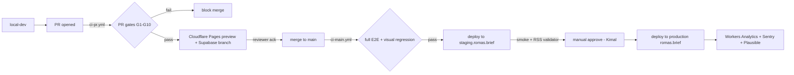

# ROMAS Brief — Deployment Plan

**Version**: 1.0.0
**Owner**: QA / Platform — drafted by QA Lead, Kimal sign-off
**Cited sources**: `CLAUDE.md` v1.1.0 (§7 tech stack, §5 audio architecture), `AGENT.md` (§11 escalation, §12 state machines), `.claude/skills/cms-schema.md`, `.claude/skills/audio-production-pipeline.md`, `.claude/skills/rss-feed-spec.md`
**Last updated**: 2026-05-14

---

## 1. Environments

| Env | Hosting | DB | R2 buckets | Secrets store | Deployers |
|---|---|---|---|---|---|
| **local-dev** | `pnpm dev` (Next.js) + `wrangler dev` (Workers) + Supabase CLI local | Supabase local (Docker) | Miniflare R2 (in-memory) | `.env.local` (gitignored) | Anyone with repo clone |
| **preview** (per-PR) | Cloudflare Pages preview deploy (`*.pages.dev`) | Supabase **branch** per PR (auto-created via Supabase MCP / CLI) | `romas-audio-archive-preview-<pr>` + `romas-audio-cdn-preview-<pr>` (lifecycle: 7d) | Cloudflare Secrets — preview scope | CI bot via GitHub Actions OIDC |
| **staging** | Cloudflare Pages `staging.romas.brief` + Workers `staging-*.romas.workers.dev` | Supabase staging project (separate org-billed project) | `romas-audio-archive-staging` + `romas-audio-cdn-staging` | Cloudflare Secrets — staging scope; Supabase Vault for service-role | CI bot on `main` merge |
| **production** | Cloudflare Pages `romas.brief` + Workers `*.romas.brief` (custom routes) | Supabase production project | `romas-audio-archive` + `romas-audio-cdn` | Cloudflare Secrets — production scope; Supabase Vault | Kimal solo (CI-gated, manual approve) until Day 30 |

Access policy:

- CMS surface (`apps/cms`) is fronted by Cloudflare Access policy: identity provider = Google Workspace / email allowlist. No public exposure.
- Reader surface (`apps/reader`) is public.
- Supabase service-role keys never leave the worker that needs them; never used from browser code.

---

## 2. Pipeline diagram



---

## 3. Deploy steps per surface

### 3.1 Reader (`apps/reader` → Cloudflare Pages)

```bash
# CI: .github/workflows/deploy-reader.yml
pnpm install --frozen-lockfile
pnpm turbo build --filter=@romas/reader
npx wrangler pages deploy apps/reader/.next \
  --project-name=romas-reader \
  --branch=<env-branch>
```

- `--branch=production` for prod; `--branch=staging` for staging; PR branch name for preview.
- Build output: Next.js static export + edge functions where required.

### 3.2 CMS (`apps/cms` → Cloudflare Pages, internal-only)

```bash
pnpm turbo build --filter=@romas/cms
npx wrangler pages deploy apps/cms/.next \
  --project-name=romas-cms \
  --branch=<env-branch>
```

Cloudflare Access policy applied at the project level — email allowlist, MFA enforced.

### 3.3 Workers (`workers/*` → `wrangler deploy`)

Workers in scope:

| Worker | Purpose | Trigger |
|---|---|---|
| `cron-ingest` | Mon-Fri 10:30 UTC source ingestion | Cron |
| `audio-producer` | Drives TTS pipeline + R2 upload | Queue (Cloudflare Queues) |
| `rss-publisher` | Regenerates per-tier feeds on `audio_status` change | Queue + cron `*/5 * * * *` safety regen |
| `cdn-purge-watchdog` | Verifies 60s SLA on revoke → CDN purge | Cron every 60s |
| `embargo-release-scan` | Hourly scan to promote `embargo_holds` past `embargo_until` | Cron `0 * * * *` |

```bash
# Per worker
cd workers/<name>
npx wrangler deploy --env=<env>
```

### 3.4 Supabase migrations

```bash
# CI: .github/workflows/db-migrate.yml
supabase db push --db-url "$SUPABASE_DB_URL_<ENV>" --include-all
# After push, run pgTAP tests against migrated DB
pg_prove --dbname "$SUPABASE_DB_URL_<ENV>" supabase/tests/*.sql
```

Service-role auth only. Forward-only migrations.

---

## 4. Cron registration

Cron entries live in each worker's `wrangler.toml` under `[[triggers]]`:

```toml
# workers/cron-ingest/wrangler.toml
[[triggers]]
crons = ["30 10 * * 1-5"]   # Mon-Fri 10:30 UTC main ingestion

# workers/audio-producer/wrangler.toml — queue-driven, no cron

# workers/rss-publisher/wrangler.toml
[[triggers]]
crons = ["*/5 * * * *"]     # safety regen every 5 min

# workers/cdn-purge-watchdog/wrangler.toml
[[triggers]]
crons = ["* * * * *"]       # every minute, checks any cdn_purge_at null >90s after revoke

# workers/embargo-release-scan/wrangler.toml
[[triggers]]
crons = ["0 * * * *"]       # hourly
```

Cron success rate tracked in Workers Analytics Engine. Alert if a cron skips two consecutive scheduled fires.

---

## 5. Secrets management

| Secret | Where | Rotation |
|---|---|---|
| `SUPABASE_SERVICE_ROLE_KEY` | Supabase Vault + Cloudflare Worker secret | 90 days; immediate on personnel change |
| `ELEVENLABS_API_KEY` + `ELEVENLABS_ROMAS_VOICE_ID` | Cloudflare Worker secret | 90 days; immediate on key leak |
| `PLAYHT_API_KEY` + `PLAYHT_USER_ID` + `PLAYHT_ROMAS_VOICE_ID` | Cloudflare Worker secret | 90 days |
| `R2_ACCESS_KEY_ID` + `R2_SECRET_ACCESS_KEY` | Cloudflare Worker secret | 90 days |
| `RESEND_API_KEY` | Cloudflare Worker secret | 90 days |
| `SENTRY_DSN` | Cloudflare Worker secret | n/a (low sensitivity) |
| `CLOUDFLARE_ZONE_ID` + `CLOUDFLARE_API_TOKEN` (purge scope) | GitHub Actions secret (CI) + Cloudflare Worker secret | 90 days |

Operational rules:

- `.env.example` is committed with **placeholders only**. `.env` is `.gitignored`.
- Secrets are set per env via `wrangler secret put <NAME> --env=<env>`.
- GitHub Actions authenticates to Cloudflare via **short-lived API token scoped to `Account / Cloudflare Pages:Edit + Account / Workers Scripts:Edit + Zone / Cache Purge`** stored as a GitHub Actions secret, rotated every **90 days** (matches §5 table). OIDC for Cloudflare from GitHub Actions is not yet first-class in Wrangler at the time of this plan; revisit at next Wrangler major release. If OIDC becomes native, switch and drop the long-lived secret. **Rotation cadence is 90 days, period** — cycle-1 critic F-P1-08 resolution: previous "weekly fallback" wording is dropped.
- `gitleaks` runs on every PR (G7) — prevents accidental commit.
- Rotation cadence: 90d for API keys, **immediate** on personnel change or suspected exposure.
- A `secrets-manifest.md` lives in `infrastructure/` listing all secrets, owner, last-rotation date, next-rotation due. Reviewed monthly.

---

## 6. Rollback procedures

| Surface | Rollback path | RTO target |
|---|---|---|
| Reader / CMS (Pages) | `wrangler pages deployment rollback --project-name=<name> --deployment-id=<prev>` | <5 min |
| Workers | `wrangler rollback --name=<worker>` (rolls to previous version) | <5 min |
| DB | **Forward-only**. No destructive rollback. Corrective migrations only (e.g., add new column nullable, then backfill, then enforce). Per `AGENT.md` §11 row "Schema change mid-cycle" — never apply destructive within publish window. | n/a |
| Audio revoke (post-publish kill switch) | `/revoke-audio` command → flips `audio_status='revoked'` → triggers CDN purge → RSS regen. **60s SLA** enforced by `cdn-purge-watchdog`. | <60s |
| RSS feed corruption | Regenerate from `audio_jobs` truth table via `rss-publisher` manual trigger. | <5 min |
| Subscriber email send-in-error | Resend has no recall. Surface as correction in next issue per `articles.status='corrected'` flow. | n/a |

**Watchdog SLA**: `cdn-purge-watchdog` polls `revocations` table every 60s; if `cdn_purge_at IS NULL` >90s after `created_at`, emits Sentry alert + writes to `source_health`.

---

## 7. Health checks

Every Worker exposes `/health` returning:

```json
{
  "status": "ok",
  "commit": "<short-sha>",
  "env": "<env>",
  "uptime_s": 12345
}
```

Reader exposes `/api/health` returning the same shape. CMS exposes the same behind Cloudflare Access.

External monitors:

- **UptimeRobot** (or Cloudflare Health Checks — confirm at scaffold; UptimeRobot is the hypothesis given zero infra spend in launch budget): every 60s on `https://romas.brief/api/health` + each RSS feed URL.
- **Supabase advisors**: run weekly via `mcp__supabase__get_advisors`, output piped into `infrastructure/db/advisor-report-<date>.md` and reviewed by Kimal.
- **Workers Analytics**: tracks cron success rate per worker; alert below 95%.

---

## 8. Observability

| Concern | Tool | Notes |
|---|---|---|
| Worker errors / exceptions | Sentry (hypothesis — confirm budget; fallback: Cloudflare Workers Logpush to R2 + Logflare) | DSN per env; PII scrubbing rules on (no PHI in scope anyway) |
| Cron success rates | Workers Analytics Engine | Alert on consecutive misses |
| Reader analytics | Plausible (cookie-free) | No GDPR consent banner required |
| Audit log | Cloudflare Logpush → `romas-logs` R2 bucket | Retention 90d hot, 1y cold |
| Audio QA outcomes | Custom dashboard fed by `audio_jobs` + `revocations` tables, visible in `apps/cms` | Tracks weekly skip / revoke ratios |
| Embargo audit | `embargo_audit_log` table (per `embargo-handling.md` §"Audit log") | Surfaced in morning brief |

**Not chosen**: Helicone is dead (Mintlify acq — sunset noted in user-global `CLAUDE.md` AI providers section). Langfuse is the LLM-observability backup if needed.

---

## 9. Disaster recovery

| Asset | Backup | RPO | Restore runbook |
|---|---|---|---|
| Supabase DB | Point-in-time recovery (PITR) enabled — built into Supabase paid tier | 1 min | `supabase db restore --project-ref=... --backup-id=...` |
| R2 archive bucket | Cross-region replication to a second R2 region (hypothesis — confirm at provisioning) | 24h | `rclone sync` from replica back to primary |
| R2 CDN bucket | Regeneratable from archive bucket + DB | 24h | Re-encode from archive WAV |
| Source code | GitHub (`kimhons/ROMAS` and ROMAS Brief repo TBD — confirm) | 0 | `git clone` |
| Secrets | Documented manifest; secrets themselves cannot be exported from Cloudflare — must be rotated | n/a | Rotate per §5 schedule |

DR drill: quarterly. Restore Supabase to a scratch project, regenerate one tier's RSS feed end-to-end, verify reader serves it. Time recorded.

---

## 10. On-call

| Phase | On-call | Escalation |
|---|---|---|
| Launch → Day 30 | Kimal solo | None (no fallback) — minimize incident surface, defer non-critical features |
| Day 30 → Day 90 | Kimal + second `audio_qa` reviewer (per `AGENT.md` §2 row 7) | Second reviewer covers audio QA overflow only |
| Day 90+ | Re-evaluate | Add platform on-call once volume warrants |

Escalation paths (`AGENT.md` §11):

- Cannot find primary source → reject, log to `source_health`, surface to `editorial-director`.
- Audio QA reviewer unavailable → hold in `in_review`, ship article without audio.
- Schema change mid-cycle → `cms-engineer` drafts, defers apply outside publish window.

---

## 11. Compliance

| Topic | Posture | Reference |
|---|---|---|
| PHI | **Not in scope.** ROMAS Brief covers published clinical-trial results, regulatory clearances, vendor news. No patient-identifiable data ingests. | `CLAUDE.md` §1 audience |
| Voice consent registry | Required pre-launch. Custom ElevenLabs voice + PlayHT clone both need signed voice-use consent on file in `infrastructure/legal/voice-consent.md`. Block production deploy without it. | `CLAUDE.md` §5 voice |
| GDPR | EU subscribers handled via Plausible (cookie-free, GDPR-clean). Email captures store IP-derived country code only, no IP itself, per Resend / Postmark defaults. Unsubscribe one-click compliant. | `CLAUDE.md` §7 analytics |
| Cookies | None for analytics (Plausible). Auth cookies on CMS only, scoped to `cms.romas.brief`, `Secure`, `HttpOnly`, `SameSite=Lax`. | Standard |
| Accessibility | WCAG 2.2 AA enforced by test plan §9. | `test-qa-plan.md` §9 |
| Embargo compliance | Schema + RSS lint enforces; violation attempt logged to `embargo_audit_log` and surfaced to Kimal. | `embargo-handling.md` §"Audit log" |
| Sponsor disclosure | If sponsored, "Sponsored by [X]" or "Partner message from [X]" label rendered. No co-branded masthead before Day 90. 32px firewall. | `CLAUDE.md` §3 row 3 |

---

## 12. Release cadence

| Surface | Cadence | Trigger |
|---|---|---|
| `main` → staging | Continuous (every merge) | GH Actions on push to `main` |
| Staging → production | Weekly at launch; tighten to daily once stability proven by Day 30 | Manual approve gate (Kimal) |
| Hotfix path | Direct merge to `main` with `hotfix/` branch prefix → fast-track to production once full CI green | Kimal approval |
| Schema migrations | Applied in same deploy as code that depends on them; **never** within the daily 06:30–07:00 ET publish window | `AGENT.md` §11 |
| Audio revoke | Out-of-band, any time, <60s SLA | `audio-qa-reviewer` action |

---

## 13. Top 3 deployment risks

1. **Audio revoke 60s SLA dependency on CDN purge primitive.** If Cloudflare cache purge falls back from "by tag" to "by URL list" with rate limits, the 60s SLA breaks during burst revokes (multi-item recall). **Mitigation**: confirm tag-based purge at provisioning; pre-tag every audio asset; load-test 10 simultaneous revokes before launch.
2. **Supabase service-role key blast radius.** A single leaked service-role key bypasses every RLS policy (per `cms-schema.md` "RLS"). **Mitigation**: gitleaks G7 blocks commits; key lives only in Worker secret store, never in browser code, never in CMS frontend env vars; 90d rotation + immediate rotation on suspected exposure.
3. **Voice consent + brand drift over time.** Both ElevenLabs and PlayHT clones can be re-tuned post-launch. Drift in narrator voice or pace would erode the QA gate's Section B/C without a code change to flag it. **Mitigation**: lock voice version IDs in env (`ELEVENLABS_ROMAS_VOICE_ID` pinned to a versioned model snapshot), require a QA-reviewer approved A/B sample on every voice-version bump, document voice consent in `infrastructure/legal/voice-consent.md` reviewed quarterly.

---

*This plan is the deployment contract. When the pipeline changes, this file changes in the same PR.*
